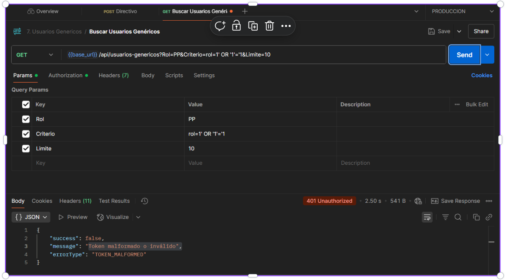
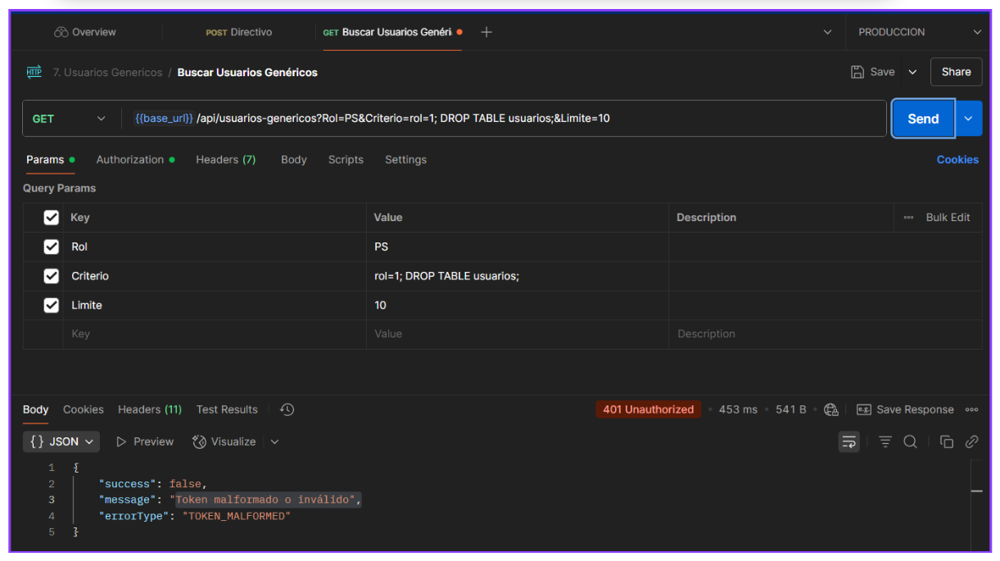
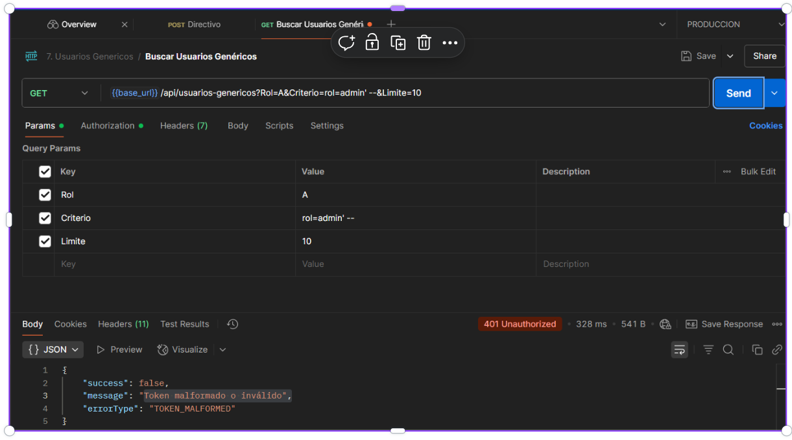
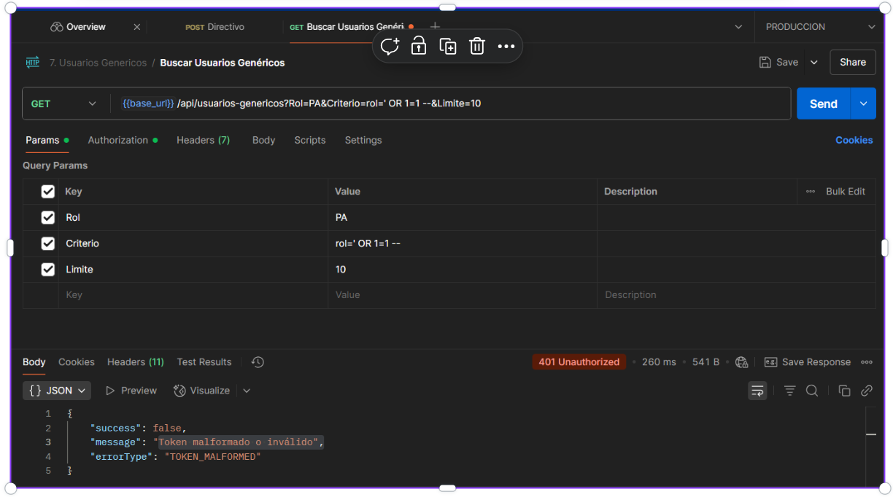

# 🚀 Test Execution: Validación de Protección contra SQL Injection en API01

> [!IMPORTANT] > **ID de Ejecución:** SIASIS-TE-10
> **Fecha de Ejecución:** 06/07/2025
> **Ejecutor:** Andry Diego
> **Duración:** 60 min
> **Estado:** ✅ Completed

---

## 📋 Información General de la Ejecución

> [!NOTE]
>
> ### 🔖 Metadatos de Ejecución
>
> |         Campo         |                                                                            Valor                                                                             |
> | :-------------------: | :----------------------------------------------------------------------------------------------------------------------------------------------------------: |
> |   **ID Ejecución**    |                                                                         SIASIS-TE-10                                                                          |
> |      **Nombre**       |                                             Validación de protección contra SQL Injection en endpoints de API01                                              |
> |     **Test Plan**     | [SIASIS-TP-4](https://github.com/GeoCoderDev/Siasis-Test-Management/blob/master/test-plans/SIASIS-TP-4/SIASIS-TP-4%20-%20SQL_Injection.md "Ir al Test Plan") |
> |  **Sprint/Release**   |                                                                              5                                                                               |
> |   **Build/Versión**   |                                                                             1.0                                                                              |
> | **Tipo de Ejecución** |                                                                     🔒 Security Testing                                                                      |
> | **Modo de Ejecución** |                                                                          👤 Manual                                                                           |
> |     **Prioridad**     |                                                                         🔴 Critical                                                                          |

---

## 🌐 Configuración del Ambiente

> [!WARNING]
>
> ### 🏗️ Detalles del Ambiente
>
> | Aspecto           |          Configuración          |
> | ----------------- | :-----------------------------: |
> | **Ambiente**      |        🧪 Producción         |
> | **URL Base**      | https://ie20935-siasis.vercel.app/ |
> | **Base de Datos** |   instancia 1 de RDP05(Redis)   |
> | **Servidor**      |         No hay detalles         |
> | **Red/VPN**       |         No hay detalles         |

> [!TIP]
>
> ### 💻 Configuración Técnica
>
> |    Tecnología     |     Versión     | Estado |
> | :---------------: | :-------------: | :----: |
> |   **Frontend**    |  React 18.2.0   |   🟢   |
> |    **Backend**    | Node.js 18.17.0 |   🟢   |
> | **Base de Datos** | PostgreSQL 15.3 |   🟢   |
> |     **Cache**     |    Redis 7.0    |   🟢   |
> |   **WebSocket**   | Socket.io 4.7.0 |   🟢   |

> [!CAUTION]
>
> ### 🖥️ Configuración de Dispositivos
>
> | Dispositivo | Sistema Operativo | Navegador   | Resolución |
> | ----------- | ----------------- | ----------- | ---------- |
> | **Desktop** | Windows 11        | Chrome 115+ | 1920x1080  |
> | **Mobile**  | Android           | Chrome      | 384x728    |

---

## 📊 Resumen de Tests a Ejecutar

> [!INFO]
>
> ### 📈 Estadísticas Generales
>
> |         Métrica         | Cantidad | Porcentaje |
> | :---------------------: | :------: | :--------: |
> |   **Total de Tests**    |    4     |    100%    |
> |   **Tests Críticos**    |    0     |     0%     |
> | **Tests Automatizados** |    0     |     0%     |
> |   **Tests Manuales**    |    4     |    100%    |
> |    **Tests Nuevos**     |    4     |    100%    |
> | **Tests de Regresión**  |    4     |    100%    |

---

## 📝 Lista Detallada de Tests

> [!NOTE]
>
> ### 🧪 Tests por Módulo/Funcionalidad
>
> #### 📝 Módulo de Registro de Asistencia Propia para Usuarios no Directivos
>
> |                                                                                                  ID Test                                                                                                   |                     Nombre                      | Tipo      | Prioridad   | Estado    | Tiempo Est. |
> | :--------------------------------------------------------------------------------------------------------------------------------------------------------------------------------------------------------: | :---------------------------------------------: | --------- | ----------- | --------- | :---------: |
> |     [SIASIS-TC-44](<https://github.com/GeoCoderDev/Siasis-Test-Management/blob/master/tests/API01/SIASIS-TC-44%20-%20Bloqueo%20de%20Inyecci%C3%B3n%20B%C3%A1sica%20(OR%201%3D1).md> "Ir al Test Case")     |      Bloqueo de Inyección Básica (OR 1=1)       | Funcional | 🔴 Critical | ✅ Passed |   2.50 s   |
> |         [SIASIS-TC-45](<https://github.com/GeoCoderDev/Siasis-Test-Management/blob/master/tests/API01/SIASIS-TC-45%20-%20Bloqueo%20de%20Comandos%20DDL%20(DROP%20TABLE)%20.md> "Ir al Test Case")          |      Bloqueo de Comandos DDL (DROP TABLE)       | Funcional | 🔴 Critical | ✅ Passed |   453 ms    |
> |   [SIASIS-TC-46](<https://github.com/GeoCoderDev/Siasis-Test-Management/blob/master/tests/API01/SIASIS-TC-46%20-%20Bloqueo%20de%20Comentarios%20SQL%20(--)%20en%20Query%20Params.md> "Ir al Test Case")    |         Bloqueo de Comentarios SQL (--)         | Funcional | 🔴 Critical | ✅ Passed |   328 ms    |
> | [SIASIS-TC-47](<https://github.com/GeoCoderDev/Siasis-Test-Management/blob/master/tests/API01/SIASIS-TC-47-%20%20Bloqueo%20de%20Condici%C3%B3n%20Siempre%20Verdadera%20(OR%201%3D1).md> "Ir al Test Case") | Bloqueo de Condición Siempre Verdadera (OR 1=1) | Funcional | 🔴 Critical | ✅ Passed |   260 ms    |

---

## 📎 Evidencias y Documentación

> [!TIP]
>
> ### 📸 Evidencias de la ejecución
>
> Capturas:
>
> 1. TC-SQLI-001: Bloqueo de Inyección Básica (OR '1'='1)
>
> 
>
> 2. TC-SQLI-002: Bloqueo de Comandos DDL (DROP TABLE)
>
> 
>
> 3. TC-SQLI-003: Bloqueo de Comentarios SQL (--)
>
> 
>
> 4. TC-SQLI-004: Bloqueo de Condición Siempre Verdadera (OR 1=1)
>
> 

## 🐛 Defectos Encontrados

> [!WARNING]
>
> No se encontraron Bugs.

---

## 🔍 Análisis de Bloqueos

> [!CAUTION]
>
> ### 🚫 Tests Bloqueados
>
> No hubieron Test Bloqueados

---

## 🛠️ Herramientas y Automatización

> [!INFO]
>
> No se usaron herramientas de automatizacion de pruebas

---

## 🚨 Gestión de Riesgos

> [!WARNING]
>
> ### ⚠️ Riesgos Identificados
>
> | Riesgo                        | Probabilidad | Impacto | Mitigación          | Responsable   |
> | ----------------------------- | ------------ | ------- | ------------------- | ------------- |
> | **Ambiente inestable**        | Media        | Alto    | Ambiente backup     | DevOps        |
> | **Datos de prueba corruptos** | Baja         | Alto    | Backup/Restore plan | QA Lead       |
> | **Ausencia de QA**            | Baja         | Medio   | Cross-training team | Test Manager  |
> | **Bloqueos por bugs**         | Alta         | Medio   | Priorización ágil   | Product Owner |

---

## 📋 Criterios de Entrada y Salida

> [!IMPORTANT]
>
> ### ✅ Criterios de Entrada (Entry Criteria)
>
> - ✅ Test Plan aprobado y actualizado
> - ✅ Ambiente de testing configurado y estable
> - ✅ Build deployado y smoke tests pasando
> - ✅ Datos de prueba preparados y validados
> - ✅ Herramientas de testing configuradas
> - ✅ Equipo de QA asignado y disponible

> [!SUCCESS]
>
> ### 🏁 Criterios de Salida (Exit Criteria)
>
> - ✅ 95% de tests ejecutados
> - ✅ 100% de tests críticos pasando
> - ✅ 0 bugs críticos abiertos
> - ✅ 0 bugs de alta prioridad abiertos
> - ✅ Cobertura de funcionalidades > 90%
> - ✅ Reporte de ejecución completo

---

## 📝 Notas y Observaciones

> [!NOTE]
>
> ### 💡 Notas de la Ejecución
>
> - [Nota importante durante la ejecución]
> - [Observación relevante]
> - [Comentario sobre el ambiente]
>
> ### 🔄 Lecciones Aprendidas
>
> - [Lección aprendida 1]
> - [Mejora para futuras ejecuciones]
> - [Optimización identificada]

> [!TIP]
>
> ### 📋 Checklist de Finalización
>
> - [x] Todos los tests ejecutados
> - [ ] Bugs reportados en Jira
> - [x] Evidencias archivadas
> - [ ] Reporte de ejecución generado
> - [ ] Métricas actualizadas
> - [x] Stakeholders notificados
> - [x] Ambiente liberado

---

**📅 Fecha de Ejecución:** 06/07/2025
**⏰ Hora de Inicio:** 6:450PM
**⏰ Hora de Finalización:** 7:45PM
**👤 Ejecutado por:** Juan Chavez
**✅ Estado Final:** Completado
