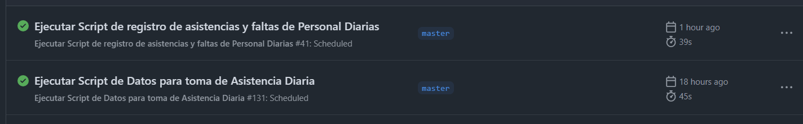
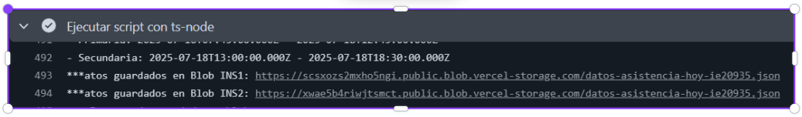
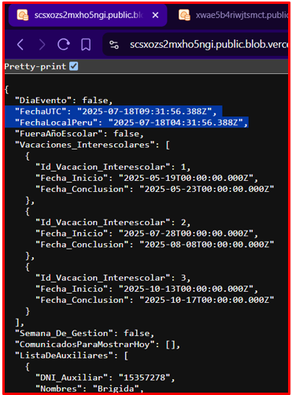
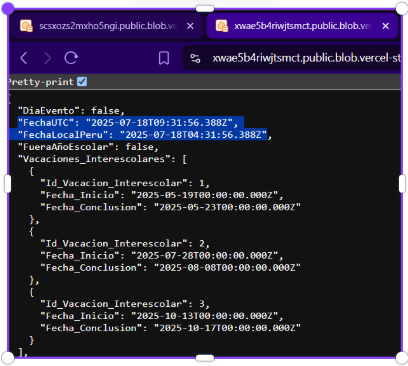

# 🚀 Test Execution: Validación de Obtención de Datos para Asistencia

> [!IMPORTANT] > **ID de Ejecución:** SIASIS-TE-13
> **Fecha de Ejecución:** 03/07/2025
> **Ejecutor:** Andry Diego
> **Duración:** 1min 30 secs
> **Estado:** ✅ Completed

---

## 📋 Información General de la Ejecución

> [!NOTE]
>
> ### 🔖 Metadatos de Ejecución
>
> | Campo                 |                                                                     Valor                                                                      |
> | --------------------- | :--------------------------------------------------------------------------------------------------------------------------------------------: |
> | **ID Ejecución**      |                                                                  SIASIS-TE-13                                                                  |
> | **Nombre**            |                               Validación de Obtención de Datos para Asistencia Diaria en Ambiente de Desarrollo                                |
> | **Test Plan**         | [SIASIS-TP-6](https://github.com/GeoCoderDev/Siasis-Test-Management/blob/master/test-plans/SIASIS-TP-6/SIASIS-TP-6.md "Test Plan Relacionado") |
> | **Sprint/Release**    |                                                                       6                                                                        |
> | **Build/Versión**     |                                                                      1.0                                                                       |
> | **Tipo de Ejecución** |                                                              🐛 Bug Verification                                                               |
> | **Modo de Ejecución** |                                                                    🔀 Mixed                                                                    |
> | **Prioridad**         |                                                                  🔴 Critical                                                                   |

---

## 🌐 Configuración del Ambiente

> [!WARNING]
>
> ### 🏗️ Detalles del Ambiente
>
> |      Aspecto      |         Configuración          |
> | :---------------: | :----------------------------: |
> |   **Ambiente**    |         🔧 Desarrollo          |
> |   **URL Base**    | https://siasis-dev.vercel.app/ |
> | **Base de Datos** | Instancia de Desarrollo RDP02  |
> |   **Servidor**    |        No hay detalles         |
> |    **Red/VPN**    |        No hay Detalles         |

> [!TIP]
>
> ### 💻 Configuración Técnica
>
> | Tecnología        |     Versión     | Estado |
> | ----------------- | :-------------: | :----: |
> | **Frontend**      |  React 18.2.0   |   🟢   |
> | **Backend**       |   Node.js 22    |   🟢   |
> | **Base de Datos** | PostgreSQL 15.3 |   🟢   |
> | **Cache**         |    Redis 7.0    |   🟢   |
> | **WebSocket**     | Socket.io 4.7.0 |   🟢   |

> [!CAUTION]
>
> ### 🖥️ Configuración de Dispositivos
>
> | Dispositivo | Sistema Operativo | Navegador   | Resolución |
> | ----------- | ----------------- | ----------- | ---------- |
> | **Desktop** | Linux             | Chrome 115+ | 1920x941   |
> | **Mobile**  | -                 | -           | -          |
> | **Tablet**  | -                 | -           | -          |

---

## 📊 Resumen de Tests a Ejecutar

> [!INFO]
>
> ### 📈 Estadísticas Generales
>
> | Métrica                 | Cantidad | Porcentaje |
> | ----------------------- | -------- | ---------- |
> | **Total de Tests**      | 2        | 100%       |
> | **Tests Críticos**      | 2        | 100%       |
> | **Tests Automatizados** | 1        | 50%        |
> | **Tests Manuales**      | 1        | 50%        |
> | **Tests Nuevos**        | 2        | 100%       |
> | **Tests de Regresión**  | 0        | 0%         |

---

## 📝 Lista Detallada de Tests

> [!NOTE]
>
> ### 🧪 Tests por Módulo/Funcionalidad
>
> #### 🔐 Módulo de Autenticación
>
> | ID Test                                                                                                                                                                                                                                    | Nombre                                                                     | Tipo      | Prioridad   | Estado    | Tiempo Est. |
> | ------------------------------------------------------------------------------------------------------------------------------------------------------------------------------------------------------------------------------------------ | -------------------------------------------------------------------------- | --------- | ----------- | --------- | ----------- |
> | [SIASIS-TC-48](https://github.com/GeoCoderDev/Siasis-Test-Management/blob/master/tests/API01/SIASIS-TC-48%20-%20Validar%20Ejecuci%C3%B3n%20Autom%C3%A1tica%20de%20Tarea%20Programada%20en%20GitHub%20Actions%20.md "Ir al Test Case")                   | Validar Ejecución Automática de Tarea Programada en GitHub Actions                 | Funcional | 🔴 Critical | ✅ Passed | 50 seg     |
> | [SIASIS-TC-49](https://github.com/GeoCoderDev/Siasis-Test-Management/blob/master/tests/API01/SIASIS-TC-49%20-%20Validar%20Integridad%20de%20Datos%20Almacenados%20en%20RDP04.md "Ir al Test Case")   | Validar Integridad de Datos Almacenados en RDP04     | Funcional | 🔴 Critical | ✅ Passed | 15 secs     |

---

## 📊 Resultados y Métricas

> [!SUCCESS]

> Ejecución automática en GitHub Actions  
> 

> Ejecución automática a las 4:30 am en días escolares (Lunes–Viernes)  
> 

> Almacena los datos en formato JSON (salida ts-node)  
> 

> JSONs almacenados en RDP04 contienen datos completos (INS1)  
> 

> JSONs almacenados en RDP04 contienen datos completos (INS2)  
> 
---

## 🐛 Defectos Encontrados

> [!WARNING]
>
> No se encontraron BUGS.

---

## 🔍 Análisis de Bloqueos

> [!CAUTION]
>
> ### 🚫 Tests Bloqueados
>
> No hubo test bloqueados, todos se ejecutaron al momento de la creación de este documento.

---

## 🛠️ Herramientas y Automatización

> [!INFO]
>
> ### 🤖 Herramientas de Automatización
>
> | Herramienta  | Versión | Propósito   | Estado |
> | ------------ | :-----: | ----------- | :----: |
> | **Selenium** | latest  | E2E Testing |   🟢   |
> | **Postman**  | latest  | API Testing |   🟢   |

> [!TIP]
>
> ### 📊 Herramientas de Reporting
>
> | Herramienta    | Propósito     |                                                                                Link                                                                                |
> | -------------- | ------------- | :----------------------------------------------------------------------------------------------------------------------------------------------------------------: |
> | **Jira**       | Bug Tracking  |                                                                                 ❌                                                                                 |
> | **Confluence** | Documentation |                                                                                 ❌                                                                                 |

---

🚨 Gestión de Riesgos

> [!WARNING]
>
> ### ⚠️ Riesgos Identificados
>
> | Riesgo                        | Probabilidad | Impacto | Mitigación          | Responsable   |
> | ----------------------------- | ------------ | ------- | ------------------- | ------------- |
> | **Ambiente inestable**        | Media        | Alto    | Ambiente backup     | DevOps        |
> | **Datos de prueba corruptos** | Baja         | Alto    | Backup/Restore plan | QA Lead       |
> | **Ausencia de QA**            | Baja         | Medio   | Cross-training team | Test Manager  |
> | **Bloqueos por bugs**         | Alta         | Medio   | Priorización ágil   | Product Owner |

---

## 📋 Criterios de Entrada y Salida

> [!IMPORTANT]
>
> ### ✅ Criterios de Entrada (Entry Criteria)
>
> - ✅ Test Plan aprobado y actualizado
> - ✅ Ambiente de testing configurado y estable
> - ✅ Build deployado y smoke tests pasando
> - ✅ Datos de prueba preparados y validados
> - ✅ Herramientas de testing configuradas
> - ✅ Equipo de QA asignado y disponible

> [!SUCCESS]
>
> ### 🏁 Criterios de Salida (Exit Criteria)
>
> - ✅ 95% de tests ejecutados
> - ✅ 100% de tests críticos pasando
> - ✅ 0 bugs críticos abiertos
> - ✅ 0 bugs de alta prioridad abiertos
> - ✅ Cobertura de funcionalidades > 90%
> - ✅ Reporte de ejecución completo

---

## 📝 Notas y Observaciones

> [!NOTE]
>
> ### 💡 Notas de la Ejecución
>
> - No hay Observaciones
>
> ### 🔄 Lecciones Aprendidas
>
> - Ninguna por el momento

> [!TIP]
>
> ### 📋 Checklist de Finalización
>
> - [x] Todos los tests ejecutados
> - [ ] Bugs reportados en Jira
> - [x] Evidencias archivadas
> - [x] Reporte de ejecución generado
> - [ ] Métricas actualizadas
> - [ ] Stakeholders notificados
> - [x] Ambiente liberado

---

**📅 Fecha de Ejecución:** 03/07/2025
**⏰ Hora de Inicio:** 02:12 PM
**⏰ Hora de Finalización:** 02:15 PM
**👤 Ejecutado por: Andry Diego - QA**
**✅ Estado Final:** Completado
