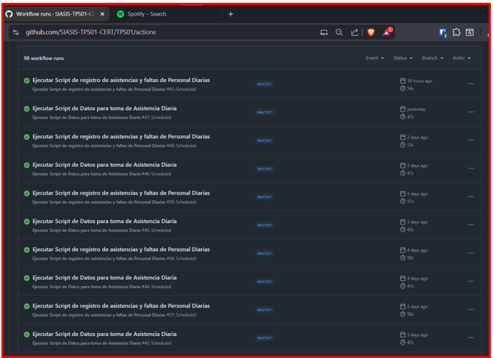
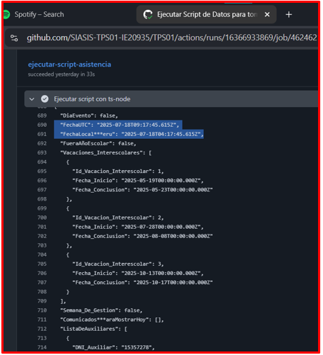
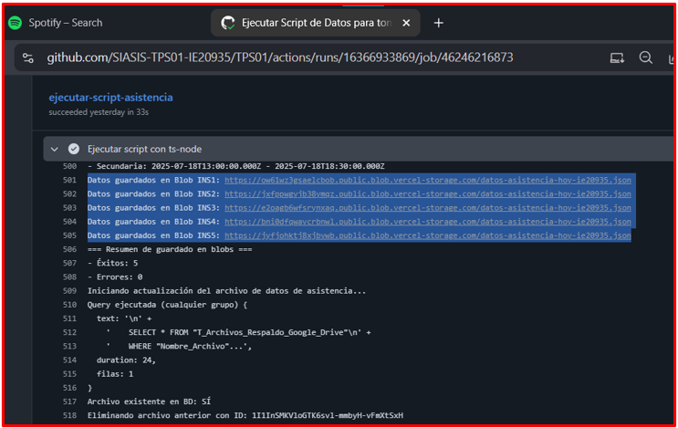
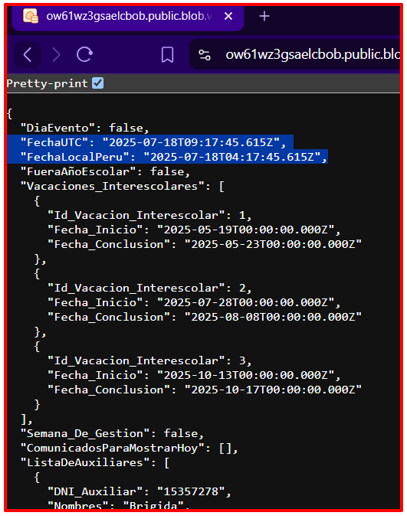
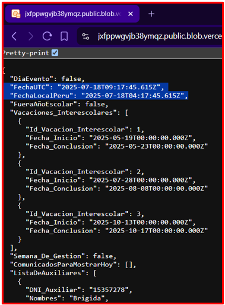
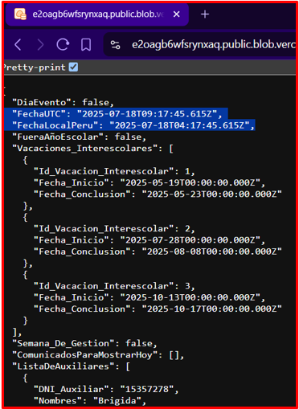
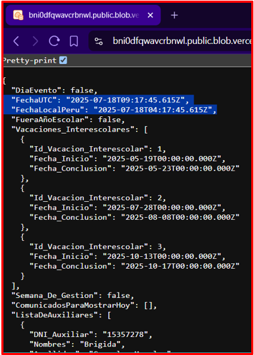

# 🚀 Test Execution: Validación de Obtención de Datos para Asistencia

> [!IMPORTANT] > **ID de Ejecución:** SIASIS-TE-17
> **Fecha de Ejecución:** 03/07/2025
> **Ejecutor:** Andry Diego
> **Duración:** 1min 30 secs
> **Estado:** ✅ Completed

---

## 📋 Información General de la Ejecución

> [!NOTE]
>
> ### 🔖 Metadatos de Ejecución
>
> | Campo                 |                                                                     Valor                                                                      |
> | --------------------- | :--------------------------------------------------------------------------------------------------------------------------------------------: |
> | **ID Ejecución**      |                                                                  SIASIS-TE-17                                                                  |
> | **Nombre**            |                               Validación de Obtención de Datos para Asistencia Diaria en Ambiente de Desarrollo                                |
> | **Test Plan**         | [SIASIS-TP-6](https://github.com/GeoCoderDev/Siasis-Test-Management/blob/master/test-plans/SIASIS-TP-6/SIASIS-TP-6.md "Test Plan Relacionado") |
> | **Sprint/Release**    |                                                                       6                                                                        |
> | **Build/Versión**     |                                                                      1.0                                                                       |
> | **Tipo de Ejecución** |                                                                 🔄 Regression                                                                  |
> | **Modo de Ejecución** |                                                                    🔀 Mixed                                                                    |
> | **Prioridad**         |                                                                  🔴 Critical                                                                   |

---

## 🌐 Configuración del Ambiente

> [!WARNING]
>
> ### 🏗️ Detalles del Ambiente
>
> |      Aspecto      |            Configuración             |
> | :---------------: | :----------------------------------: |
> |   **Ambiente**    |            🔧 Desarrollo             |
> |   **URL Base**    |  https://ie20935-siasis.vercel.app/  |
> | **Base de Datos** |    Instancia de Desarrollo RDP02     |
> |   **Servidor**    |   Vercel Certification Environment   |
> |    **Red/VPN**    | Red corporativa con certificados SSL |

> [!TIP]
>
> ### 💻 Configuración Técnica
>
> | Tecnología        |     Versión     | Estado |
> | ----------------- | :-------------: | :----: |
> | **Frontend**      |  React 18.2.0   |   🟢   |
> | **Backend**       |   Node.js 22    |   🟢   |
> | **Base de Datos** | PostgreSQL 15.3 |   🟢   |
> | **Cache**         |    Redis 7.0    |   🟢   |
> | **WebSocket**     | Socket.io 4.7.0 |   🟢   |

> [!CAUTION]
>
> ### 🖥️ Configuración de Dispositivos
>
> | Dispositivo | Sistema Operativo | Navegador             | Resolución |
> | ----------- | ----------------- | --------------------- | ---------- |
> | **Desktop** | Linux             | Chrome 115+           | 1920x941   |
> | **Server**  | Ubuntu 22.04      | GitHub Actions Runner | -          |

---

## 📊 Resumen de Tests a Ejecutar

> [!INFO]
>
> ### 📈 Estadísticas Generales
>
> | Métrica                 | Cantidad | Porcentaje |
> | ----------------------- | -------- | ---------- |
> | **Total de Tests**      | 2        | 100%       |
> | **Tests Críticos**      | 2        | 100%       |
> | **Tests Automatizados** | 1        | 50%        |
> | **Tests Manuales**      | 1        | 50%        |
> | **Tests Nuevos**        | 0        | 0%         |
> | **Tests de Regresión**  | 2        | 100%       |

---

## 📝 Lista Detallada de Tests

> [!NOTE]
>
> ### 🧪 Tests por Módulo/Funcionalidad
>
> #### 🔐 Módulo de Autenticación
>
> | ID Test                                                                                                                                                                                                                               | Nombre                                                             | Tipo        | Prioridad   | Estado    | Tiempo Est. |
> | ------------------------------------------------------------------------------------------------------------------------------------------------------------------------------------------------------------------------------------- | ------------------------------------------------------------------ | ----------- | ----------- | --------- | ----------- |
> | [SIASIS-TC-48](https://github.com/GeoCoderDev/Siasis-Test-Management/blob/master/tests/API01/SIASIS-TC-48%20-%20Validar%20Ejecuci%C3%B3n%20Autom%C3%A1tica%20de%20Tarea%20Programada%20en%20GitHub%20Actions%20.md "Ir al Test Case") | Validar Ejecución Automática de Tarea Programada en GitHub Actions | Funcional   | 🔴 Critical | ✅ Passed | 1 min       |
> | [SIASIS-TC-49](https://github.com/GeoCoderDev/Siasis-Test-Management/blob/master/tests/API01/SIASIS-TC-49%20-%20Validar%20Integridad%20de%20Datos%20Almacenados%20en%20RDP04.md "Ir al Test Case")                                    | Validar Integridad de Datos Almacenados en RDP04                   | Integration | 🔴 Critical | ✅ Passed | 15 secs     |

---

## 📊 Resultados y Métricas

> [!SUCCESS]

> **Ejecución automática en GitHub Actions**
>
> 

> **Ejecución automática a las 4:30 am en días escolares (Lunes–Viernes)**
>
> 
> 
> **Almacena los datos en formato JSON (salida ts-node)**
>
> 

> **JSONs almacenados en RDP04 contienen datos completos (INS1) - Inicia a las 4:30 am**
>
> 

> **JSONs almacenados en RDP04 contienen datos completos (INS2) - Inicia a las 4:30 am**
>
> 
>
> **JSONs almacenados en RDP04 contienen datos completos (INS3) - Inicia a las 4:30 am**
>
> !
>
> **JSONs almacenados en RDP04 contienen datos completos (INS4) - Inicia a las 4:30 am**
>
> 
>
> **JSONs almacenados en RDP04 contienen datos completos (INS5) - Inicia a las 4:30 am**
>
> 

---

## 🐛 Defectos Encontrados

> [!WARNING]
>
> No se encontraron BUGS.

---

## 🔍 Análisis de Bloqueos

> [!CAUTION]
>
> ### 🚫 Tests Bloqueados
>
> No hubo test bloqueados, todos se ejecutaron al momento de la creación de este documento.

---

## 🛠️ Herramientas y Automatización

> [!INFO]
>
> ### 🤖 Herramientas de Automatización
>
> | Herramienta           | Versión | Propósito                            | Estado |
> | --------------------- | :-----: | ------------------------------------ | :----: |
> | **GitHub Actions**    | latest  | Automatización de Tareas Programadas |   🟢   |
> | **JSON Validator**    | latest  | Validación de JSON                   |   🟢   |
> | **Node.js (ts-node)** | latest  | Ejecución de Scripts                 |   🟢   |

> [!TIP]
>
> ### 📊 Herramientas de Reporting
>
> | Herramienta    | Propósito     | Link |
> | -------------- | ------------- | :--: |
> | **Jira**       | Bug Tracking  |  ❌  |
> | **Confluence** | Documentation |  ❌  |

---

# 🚨 Gestión de Riesgos

> [!WARNING]
>
> ### ⚠️ Riesgos Identificados
>
> | Riesgo                                        | Probabilidad | Impacto | Mitigación                                         | Responsable   |
> | --------------------------------------------- | ------------ | ------- | -------------------------------------------------- | ------------- |
> | **Falla en ejecución de GitHub Actions**      | Baja         | Medio   | Monitoreo de logs y validación previa de workflows | DevOps Team   |
> | **Datos almacenados incompletos**             | Baja         | Bajo    | Validación manual y comparación con datos fuente   | QA Tester     |
> | **Errores en formato JSON**                   | Baja         | Bajo    | Uso de herramientas como JSON Validator            | QA Tester     |
> | **Tiempos de ejecución elevados**             | Media        | Medio   | Optimización de queries API y scripts TS-Node      | Tech Lead     |
> | **Acceso limitado a blobs en Vercel (RDP04)** | Baja         | Medio   | Verificación de permisos y credenciales            | DevOps Team   |
> | **Impacto en usuarios en producción**         | Baja         | Medio   | Ventana de mantenimiento planificada               | Product Owner |

---

## 📋 Criterios de Entrada y Salida

> [!IMPORTANT]
>
> ### ✅ Criterios de Entrada (Entry Criteria)
>
> - ✅ Test Plan aprobado y actualizado
> - ✅ Ambiente de testing configurado y estable
> - ✅ GitHub Actions configurado en repositorio
> - ✅ RDP04 (Vercel Blob) accesible
> - ✅ Datos de prueba en RDP02 preparados
> - ✅ Workflow de GitHub Actions habilitado

> [!SUCCESS]
>
> ### 🏁 Criterios de Salida (Exit Criteria)
>
> - ✅ 95% de tests ejecutados
> - ✅ 100% de tests críticos pasando
> - ✅ GitHub Actions ejecutándose correctamente
> - ✅ Datos almacenados correctamente en RDP04
> - ✅ Cobertura de funcionalidades > 90%
> - ✅ Reporte de ejecución completo

---

## 📝 Notas y Observaciones

> [!NOTE]
>
> ### 💡 Notas de la Ejecución
>
> - Dependiente de la exitosa ejecución de TE-13 (Desarrollo)
> - Validación exhaustiva de performance y seguridad
> - Prerequisito para deployment a producción
>
> ### 🔄 Lecciones Aprendidas
>
> - Ninguna por el momento

> [!TIP]
>
> ### 📋 Checklist de Finalización
>
> - [x] Todos los tests ejecutados
> - [ ] Bugs reportados en Jira
> - [x] Evidencias archivadas
> - [x] Reporte de ejecución generado
> - [ ] Métricas actualizadas
> - [ ] Stakeholders notificados
> - [x] Ambiente liberado

---

**📅 Fecha de Ejecución:** 03/07/2025
**⏰ Hora de Inicio:** 02:12 PM
**⏰ Hora de Finalización:** 02:15 PM
**👤 Ejecutado por: Andry Diego - QA**
**✅ Estado Final:** Completado
