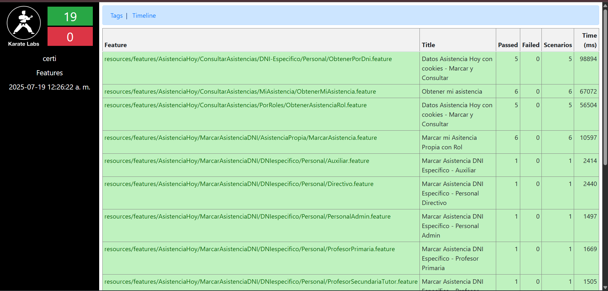
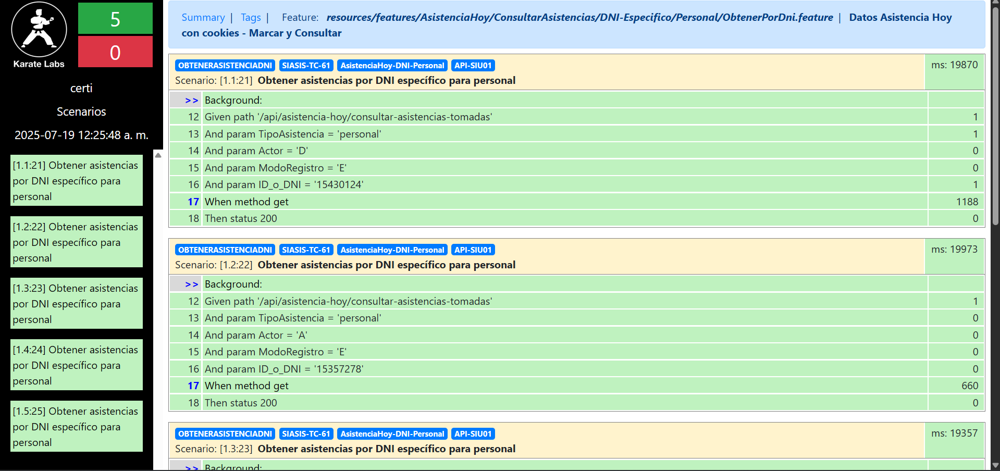

# 🚀 Test Execution: Validar correcto funcionamiento de los Endpoints de API SIU01 - COOKIES

> [!IMPORTANT]
> **ID de Ejecución:** SIASIS-TE-14
> **Fecha de Ejecución:** 19/07/2025
> **Ejecutor:** Jose Gil
> **Duración:** 1 min
> **Estado:** ✅ Completed

---

## 📋 Información General de la Ejecución

> [!NOTE]
>
> ### 🔖 Metadatos de Ejecución
>
>
> |         Campo         |                                                                                   Valor                                                                                   |
> | :----------------------: | :-------------------------------------------------------------------------------------------------------------------------------------------------------------------------: |
> |   **ID Ejecución**   |                                                                               SIASIS-TE-14                                                                              |
> |       **Nombre**       |                                                      Validar correcto funcionamiento Endpoints utilizados para APISIU01 - COOKIES                                                      |
> |     **Test Plan**     | [SIASIS-TP-7](https://https://github.com/GeoCoderDev/Siasis-Test-Management/blob/master/test-plans/SIASIS-TP-5/SIASIS-TP-5%20-%20Endpoints%20API01.md)("Ir al Test Plan") |
> |   **Sprint/Release**   |                                                                                     5                                                                                     |
> |   **Build/Versión**   |                                                                                    1.0                                                                                    |
> | **Tipo de Ejecución** |                                                                   ✨ New Features\| 🐛 Bug Verification                                                                   |
> | **Modo de Ejecución** |                                                                              👤 Automatizado                                                                              |
> |     **Prioridad**     |                                                                                 🟢 Medium                                                                                 |

---

## 🌐 Configuración del Ambiente

> [!WARNING]
>
> ### 🏗️ Detalles del Ambiente
>
>
> | Aspecto           |         Configuración         |
> | ------------------- | :-------------------------------: |
> | **Ambiente**      |        🧪 Certificación        |
> | **URL Base**      | https://siasis-cert.vercel.app |
> | **Base de Datos** | instancia 1,2,3 de RDP05(Redis) |
> | **Servidor**      |         No hay detalles         |
> | **Red/VPN**       |         No hay detalles         |

> [!TIP]
>
> ### 💻 Configuración Técnica
>
>
> |    Tecnología    |    Versión    | Estado |
> | :-----------------: | :---------------: | :------: |
> |   **Frontend**   |  React 18.2.0  |   🟢   |
> |    **Backend**    | Node.js 18.17.0 |   🟢   |
> | **Base de Datos** | PostgreSQL 15.3 |   🟢   |
> |     **Cache**     |    Redis 7.0    |   🟢   |
> |   **WebSocket**   | Socket.io 4.7.0 |   🟢   |

> [!CAUTION]
>
> ### 🖥️ Configuración de Dispositivos
>
>
> | Dispositivo | Sistema Operativo | Navegador   |
> | ------------- | ------------------- | ------------- |
> | **Desktop** | Windows 11        | Chrome 115+ |

---

## 📊 Resumen de Tests a Ejecutar

> [!INFO]
>
> ### 📈 Estadísticas Generales
>
>
> |        Métrica        | Cantidad | Porcentaje |
> | :-----------------------: | :--------: | :----------: |
> |   **Total de Tests**   |    13    |    100%    |
> |   **Tests Críticos**   |    0    |     0%     |
> | **Tests Automatizados** |    0    |     0%     |
> |   **Tests Manuales**   |    0    |     0%     |
> |    **Tests Nuevos**    |    13    |    100%    |
> | **Tests de Regresión** |    13    |    100%    |

---

## 📝 Lista Detallada de Tests

> [!NOTE]
>
> ### 🧪 Tests por Módulo/Funcionalidad
>
> #### 📝 Módulo de Endpoints API01
>
>
> |                                                                                                                          ID Test                                                                                                                          |                                                   Nombre                                                   | Tipo      | Prioridad | Estado    | Tiempo Est. |
> | :----------------------------------------------------------------------------------------------------------------------------------------------------------------------------------------------------------------------------------------------------------: | :----------------------------------------------------------------------------------------------------------: | ----------- | ----------- | ----------- | :-----------: |
> |                                   [SIASIS-TC-50](https://github.com/GeoCoderDev/Siasis-Test-Management/blob/master/tests/API01/SIASIS-TC-12%20-%20Validar%20Inicio%20de%20Sesion%20Como%20Auxiliar.md "Ir al Test Case")                                   |                          Validar el metodo POST del endpoint que realiza el Set Cookies                         | Funcional | 🟢 Medium | ✅ Passed |    1 min    |
> |                            [SIASIS-TC-51](https://github.com/GeoCoderDev/Siasis-Test-Management/blob/master/tests/API01/SIASIS-TC-13%20-%20Validar%20Inicio%20de%20Sesion%20Como%20Profesor%20Secundaria.md "Ir al Test Case")                            |             Validar el metodo GET para obtener los datos de Asistencia              | Funcional | 🟢 Medium | ✅ Passed |    2 min    |
> |                                   [SIASIS-TC-52](https://github.com/GeoCoderDev/Siasis-Test-Management/blob/master/tests/API01/SIASIS-TC-14%20-%20Validar%20Inicio%20de%20Sesion%20Como%20Tutor%20.md "Ir al Test Case")                                   |                     Validar el metodo POST para marcar Asistencia con DNI para el el rol de Directivo| Funcional | 🟢 Medium | ✅ Passed |    2 min    |
> |                                  [SIASIS-TC-53](https://github.com/GeoCoderDev/Siasis-Test-Management/blob/master/tests/API01/SIASIS-TC-15%20-%20Validar%20Inicio%20de%20Sesion%20Como%20Directivo.mdd "Ir al Test Case")                                  |                        Validar el metodo POST para marcar Asistencia con DNI para el el rol de Auxiliar                        | Funcional | 🟢 Medium | ✅ Passed |    1 min    |
> |                               [SIASIS-TC-54](https://github.com/GeoCoderDev/Siasis-Test-Management/blob/master/tests/API01/SIASIS-TC-16%20-%20Validar%20Inicio%20de%20Sesion%20Como%20Personal%20Admin.md "Ir al Test Case")                               |                       Validar el metodo POST para marcar Asistencia con DNI para el el rol de Admin                      | Funcional | 🟢 Medium | ✅ Passed |    2 min    |
> |                           [SIASIS-TC-55](https://github.com/GeoCoderDev/Siasis-Test-Management/blob/master/tests/API01/SIASIS-TC-17%20-%20Validar%20Inicio%20de%20Sesion%20Como%20Profesor%20de%20Primaria.md "Ir al Test Case")                           |                    Validar el metodo POST para marcar Asistencia con DNI para el el rol de Profesor Primaria                   | Funcional | 🟢 Medium | ✅ Passed |    2 min    |
> |                   [SIASIS-TC-56](https://github.com/GeoCoderDev/Siasis-Test-Management/blob/master/tests/API01/SIASIS-TC-18%20-%20Validar%20Cambio%20de%20Foto%20de%20Perfil%20Como%20Profesor%20de%20Primaria%20.md "Ir al Test Case")                   |                         Validar el metodo POST para marcar Asistencia con DNI para el el rol de Profesor Secundaria - Tutor| Funcional | 🟢 Medium | ✅ Passed |    2 min    |
> |                        [SIASIS-TC-57](https://github.com/GeoCoderDev/Siasis-Test-Management/blob/master/tests/API01/SIASIS-TC-19%20-%20Validar%20Cambio%20de%20Foto%20de%20Perfil%20Como%20Auxiliar%20%20copy.md "Ir al Test Case")                        |                               Validar el metodo POST para marcar Asistencia con DNI para estudiantes de Secundaria con el rol  de Auxiliar                               | Funcional | 🟢 Medium | ✅ Passed |    2 min    |
> |                            [SIASIS-TC-58](https://github.com/GeoCoderDev/Siasis-Test-Management/blob/master/tests/API01/SIASIS-TC-20%20-%20Validar%20Cambio%20de%20Foto%20de%20Perfil%20Como%20No%20Tutor.md "Ir al Test Case")                            |                              Validar el metodo POST para marcar Asistencia con DNI para estudiantes de Primaria con el rol de Profesor de Primaria                               | Funcional | 🟢 Medium | ✅ Passed |    2 min    |
> |                             [SIASIS-TC-59](https://github.com/GeoCoderDev/Siasis-Test-Management/blob/master/tests/API01/SIASIS-TC-21%20-%20Validar%20Cambio%20de%20Foto%20de%20Perfil%20Como%20Tutor%20.md "Ir al Test Case")                             |                         Validar el metodo POST para marcar mi Asistencia propia para todos los roles  | Funcional | 🟢 Medium | ✅ Passed |    2 min    |
> |                            [SIASIS-TC-60](https://github.com/GeoCoderDev/Siasis-Test-Management/blob/master/tests/API01/SIASIS-TC-22%20-%20Validar%20Cambio%20de%20Foto%20de%20Perfil%20Como%20Directivo.md "Ir al Test Case")                            |                       Validar el metodo GET para obtener las asistencias por cada Rol                      | Funcional | 🟢 Medium | ✅ Passed |    2 min    |
> |                         [SIASIS-TC-61](https://github.com/GeoCoderDev/Siasis-Test-Management/blob/master/tests/API01/SIASIS-TC-23%20-%20Validar%20Cambio%20de%20Foto%20de%20Perfil%20Como%20Personal%20Admin.md "Ir al Test Case")                         |                   Validar el metodo GET para obtener las asistencias especificas por DNI                    | Funcional | 🟢 Medium | ✅ Passed |    2 min    |
> |                 [SIASIS-TC-62](https://github.com/GeoCoderDev/Siasis-Test-Management/blob/master/tests/API01/SIASIS-TC-24%20-%20Validar%20la%20obtenci%C3%B3n%20de%20datos%20del%20rol%20Profesor%20de%20Primaria%20.md "Ir al Test Case")                 |                        Validar el metodo GET para obtener mi propia asistencia                        | Funcional | 🟢 Medium | ✅ Passed |    2 min    |

---

## 📎 Evidencias y Documentación

> [!TIP]
>
> ### 📸 Evidencias de la ejecución
>

>

>
>

## 🐛 Defectos Encontrados

> [!WARNING]
>
> No se encontraron Bugs.

---

## 🔍 Análisis de Bloqueos

> [!CAUTION]
>
> ### 🚫 Tests Bloqueados
>
> No hubieron Test Bloqueados

---

## 🛠️ Herramientas y Automatización

> [!INFO]
>
> Se utilizo Karate Labs como herramienta de Automatizacion

---

## 🚨 Gestión de Riesgos

> [!WARNING]
>
> ### ⚠️ Riesgos Identificados
>
>
> | Riesgo                        | Probabilidad | Impacto | Mitigación         | Responsable   |
> | ------------------------------- | -------------- | --------- | --------------------- | --------------- |
> | **Ambiente inestable**        | Media        | Alto    | Ambiente backup     | DevOps        |
> | **Datos de prueba corruptos** | Baja         | Alto    | Backup/Restore plan | QA Lead       |
> | **Ausencia de QA**            | Baja         | Medio   | Cross-training team | Test Manager  |
> | **Bloqueos por bugs**         | Alta         | Medio   | Priorización ágil | Product Owner |

---

## 📋 Criterios de Entrada y Salida

> [!IMPORTANT]
>
> ### ✅ Criterios de Entrada (Entry Criteria)
>
> - ✅ Test Plan aprobado y actualizado
> - ✅ Ambiente de testing configurado y estable
> - ✅ Build deployado y smoke tests pasando
> - ✅ Datos de prueba preparados y validados
> - ✅ Herramientas de testing configuradas
> - ✅ Equipo de QA asignado y disponible

> [!SUCCESS]
>
> ### 🏁 Criterios de Salida (Exit Criteria)
>
> - ✅ 95% de tests ejecutados
> - ✅ 100% de tests críticos pasando
> - ✅ 0 bugs críticos abiertos
> - ✅ 0 bugs de alta prioridad abiertos
> - ✅ Cobertura de funcionalidades > 90%
> - ✅ Reporte de ejecución completo

---

## 📝 Notas y Observaciones

> [!NOTE]
>
> ### 💡 Notas de la Ejecución
>
> - [Nota importante durante la ejecución]
> - [Observación relevante]
> - [Comentario sobre el ambiente]
>
> ### 🔄 Lecciones Aprendidas
>
> - [Lección aprendida 1]
> - [Mejora para futuras ejecuciones]
> - [Optimización identificada]

> [!TIP]
>
> ### 📋 Checklist de Finalización
>
> - [X] Todos los tests ejecutados
> - [ ] Bugs reportados en Jira
> - [X] Evidencias archivadas
> - [x] Reporte de ejecución generado
> - [ ] Métricas actualizadas
> - [X] Stakeholders notificados
> - [X] Ambiente liberado

---

**📅 Fecha de Ejecución:** /07/2025
**⏰ Hora de Inicio:** 23:50hs
**⏰ Hora de Finalización:** 23:51hs
**👤 Ejecutado por:** Jose Gil
**✅ Estado Final:** Completado
