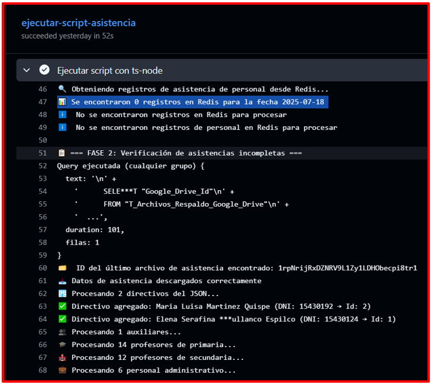
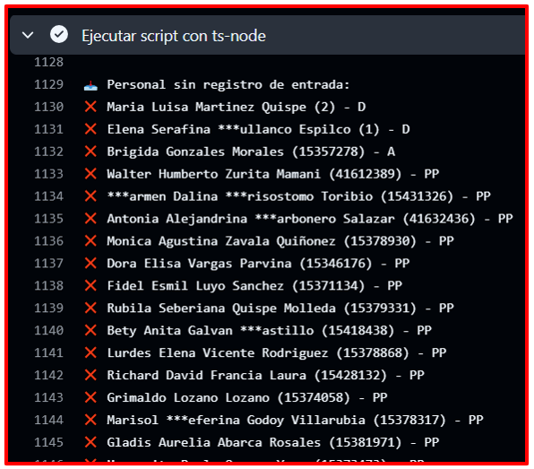
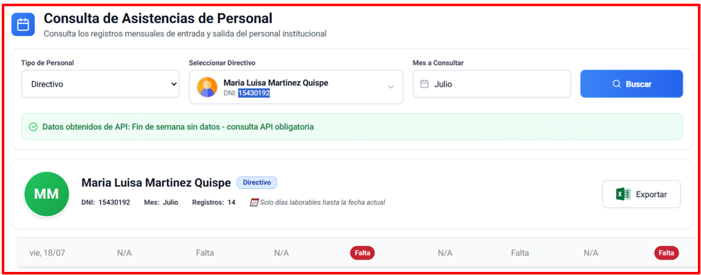

# 🚀 Test Execution: Transacción de Datos de Redis a PostgreSQL y Registro Automático de Faltas - Certificación

> [!IMPORTANT] > **ID de Ejecución:** SIASIS-TE-20
> **Fecha de Ejecución:** 20/07/2025
> **Ejecutor:** Andry Diego
> **Duración:** 36s
> **Estado:** ✅ Completed

---

## 📋 Información General de la Ejecución

> [!NOTE]
>
> ### 🔖 Metadatos de Ejecución
>
> | Campo                 | Valor                                                                                                                                          |
> | --------------------- | ---------------------------------------------------------------------------------------------------------------------------------------------- |
> | **ID Ejecución**      | SIASIS-TE-20                                                                                                                                   |
> | **Nombre**            | Transacción de Datos de Redis a PostgreSQL y Registro Automático de Faltas - Ambiente de Certificación                                         |
> | **Test Plan**         | [SIASIS-TP-8](https://github.com/GeoCoderDev/Siasis-Test-Management/blob/master/test-plans/SIASIS-TP-8/SIASIS-TP-8.md "Test Plan Relacionado") |
> | **Sprint/Release**    | 6                                                                                                                                              |
> | **Build/Versión**     | 1.0                                                                                                                                            |
> | **Tipo de Ejecución** | 🧪 Pre-Production Validation                                                                                                                   |
> | **Modo de Ejecución** | 🔀 Mixed                                                                                                                                       |
> | **Prioridad**         | 🔴 Critical                                                                                                                                    |

---

## 🌐 Configuración del Ambiente

> [!WARNING]
>
> ### 🏗️ Detalles del Ambiente
>
> | Aspecto           | Configuración                               |
> | ----------------- | ------------------------------------------- |
> | **Ambiente**      | 🧪 Certification                            |
> | **URL Base**      | https://siasis-cert.vercel.app/             |
> | **Base de Datos** | Instancia de Certificación RDP02 PostgreSQL |
> | **Servidor**      | Vercel Certification Environment            |
> | **Red/VPN**       | Red corporativa con certificados SSL + VPN  |

> [!TIP]
>
> ### 💻 Configuración Técnica
>
> | Tecnología         | Versión          | Estado |
> | ------------------ | ---------------- | ------ |
> | **Frontend**       | React 18.2.0     | 🟢     |
> | **Backend**        | Node.js 22.0     | 🟢     |
> | **Base de Datos**  | PostgreSQL 15.3  | 🟢     |
> | **Cache**          | Redis 7.0 (Cert) | 🟢     |
> | **GitHub Actions** | Latest           | 🟢     |

> [!CAUTION]
>
> ### 🖥️ Configuración de Dispositivos
>
> | Dispositivo | Sistema Operativo | Navegador             | Resolución |
> | ----------- | ----------------- | --------------------- | ---------- |
> | **Desktop** | Linux             | Chrome 115+           | 1920x941   |
> | **Server**  | Ubuntu 22.04      | GitHub Actions Runner | -          |

---

## 📊 Resumen de Tests a Ejecutar

> [!INFO]
>
> ### 📈 Estadísticas Generales
>
> | Métrica                          | Cantidad | Porcentaje |
> | -------------------------------- | -------- | ---------- |
> | **Total de Tests**               | 1        | 100%       |
> | **Tests Críticos**               | 1        | 100%       |
> | **Tests Automatizados**          | 1        | 100%       |
> | **Tests Manuales**               | 0        | 0%         |
> | **Tests de Validación Pre-Prod** | 1        | 100%       |
> | **Tests de Regresión**           | 0        | 0%         |

---

## 📝 Lista Detallada de Tests

> [!NOTE]
>
> ### 🧪 Tests por Módulo/Funcionalidad
>
> #### 🔄 Módulo de Transacción de Datos y Registro de Faltas
>
> | ID Test                                                                                                                                                                                                                                                        | Nombre                                                                     | Tipo        | Prioridad   | Estado    | Tiempo Real |
> | -------------------------------------------------------------------------------------------------------------------------------------------------------------------------------------------------------------------------------------------------------------- | -------------------------------------------------------------------------- | ----------- | ----------- | --------- | ----------- |
> | [SIASIS-TC-63](https://github.com/GeoCoderDev/Siasis-Test-Management/blob/master/tests/TPS01/SIASIS-TC-63%20-%20Validar%20Transacci%C3%B3n%20de%20Datos%20de%20Redis%20a%20PostgreSQL%20y%20Registro%20Autom%C3%A1tico%20de%20Faltas.md "Ir al Test Case") | Transacción de Datos de Redis a PostgreSQL y Registro Automático de Faltas | Integration | 🔴 Critical | ✅ Passed | 2min 30secs |

---

## 📊 Resultados y Métricas

> [!SUCCESS]
>
> ### 📈 Resultados de Ejecución
>
> | Estado           | Cantidad | Porcentaje | Icono |
> | ---------------- | -------- | :--------: | :---: |
> | **Passed**       | 1        |    100%    |  ✅   |
> | **Failed**       | 0        |     0%     |  ❌   |
> | **Blocked**      | 0        |     0%     |  🚫   |
> | **Skipped**      | 0        |     0%     |  ⏭️   |
> | **In Progress**  | 0        |     0%     |  🔄   |
> | **Not Executed** | 0        |     0%     |  ⏳   |

> [!INFO]
>
> ### ⏱️ Métricas de Tiempo
>
> | Métrica                       | Estimado | Actual | Diferencia |
> | ------------------------------ | -------- | ------ | ---------- |
> | **Tiempo Total**         | 5 min   | 36s  | -4min 24secs      |
> | **Tiempo Promedio/Test** | 5 min | 36s  | -4min 24secs      |
> | **Tests/Hora**           | 12      | 100      | +88          |
> | **Tiempo Setup**         | 30 secs   | 12 secs  | -18 secs      |
> | **Tiempo Cleanup**       | 15 secs   | 8 secs  | -7 secs      |

---

## 🎯 Evidencias Detalladas de Ejecución

 ### 📸 Evidencia 1: Validación de Consulta en Redis
>
> **Descripción:** Se verificó que la tarea programada consulta correctamente los registros de asistencia almacenados en Redis RDP05 para la fecha 2025-07-18.
>
>
>
>
>
> **Validaciones Realizadas:**
> - ✅ Tarea programada ejecutada automáticamente a las 9:30pm
> - ✅ Script ts-node iniciado correctamente
> - ✅ Conexión exitosa a Redis RDP05
> - ✅ Se detectaron **0 registros** en Redis para la fecha 2025-07-18
> - ✅ Sistema manejó correctamente el escenario sin datos
> - ✅ Roles bloqueados durante 10 minutos para evitar conflictos

> [!SUCCESS]
>
> ### 📸 Evidencia 2: Procesamiento de Registro Redis Personal RDP02
>
> **Descripción:** El sistema procesó correctamente la identificación de personal sin registro de entrada, registrando automáticamente las faltas correspondientes.
>
> 
>

> [!SUCCESS]
>
> ### 📸 Evidencia 3: Procesamiento de Personal sin Registro de Salida
>
> **Descripción:** El sistema identificó y procesó correctamente al personal que no registró su salida, aplicando las reglas de negocio correspondientes.
>
> 
>

> [!SUCCESS]
>
> ### 📸 Evidencia 4: Interfaz que Valida la Falta
>
> **Descripción:** La interfaz web de consulta de asistencias muestra correctamente las faltas registradas automáticamente por el sistema.
>
> 
>
> **Validaciones Realizadas:**
> - ✅ Interfaz de "Consulta de Asistencias de Personal" cargada correctamente
> - ✅ Filtro por "Director" aplicado exitosamente
> - ✅ Consulta del mes de "Julio" ejecutada
> - ✅ Registro de **14 registros** mensuales mostrados
> - ✅ **Faltas automáticas** registradas correctamente:
>   - Vie, 18/07: **Falta** (sin entrada) - Marcado en rojo
>   - Vie, 18/07: **Falta** (sin salida) - Marcado en rojo
> - ✅ Funcionalidad de exportar a Excel disponible
> - ✅ Datos actualizados en tiempo real post-procesamiento

---

## 🧪 Validaciones Específicas de Certificación

> [!WARNING]
>
> ### 🔒 Validaciones de Seguridad
>
> | Validación                | Estado | Observaciones                    |
> | ------------------------- | ------ | -------------------------------- |
> | **Autenticación API**     | ✅     | Tokens válidos y seguros         |
> | **Conexiones SSL**        | ✅     | Certificados actualizados        |
> | **Permisos de BD**        | ✅     | Acceso restringido correctamente |
> | **Logs de Auditoría**     | ✅     | Registros completos generados    |
> | **Timeout de Conexiones** | ✅     | Dentro de límites establecidos   |

> [!TIP]
>
> ### 📊 Validaciones de Datos
>
> | Validación                     | Estado | Resultado              |
> | ------------------------------ | ------ | ---------------------- |
> | **Integridad Referencial**     | ✅     | Sin violaciones        |
> | **Consistencia de Timestamps** | ✅     | Formatos correctos     |
> | **Validación de DNIs**         | ✅     | Formato y unicidad OK  |
> | **Roles y Permisos**           | ✅     | Asignaciones correctas |
> | **Datos Históricos**           | ✅     | No alterados           |

---

## 🛠️ Herramientas y Automatización

> [!INFO]
>
> ### 🤖 Herramientas de Automatización
>
> | Herramienta         | Versión | Propósito                       | Estado |
> | ------------------- | ------- | ------------------------------- | ------ |
> | **GitHub Actions**  | Latest  | Ejecución de tareas programadas | 🟢     |
> | **ts-node**         | Latest  | Ejecución de scripts TypeScript | 🟢     |
> | **Redis CLI**       | 7.0     | Consultas a Redis RDP05 (Cert)  | 🟢     |
> | **PostgreSQL**      | 15.3    | Base de datos RDP02 (Cert)      | 🟢     |
> | **Chrome DevTools** | 115.0   | Validación de interfaz web      | 🟢     |

---

## 🐛 Defectos Encontrados

> [!WARNING]
>
> ### 🚨 Bugs Registrados Durante la Ejecución
>
> No se encontraron bugs durante la ejecución en certificación. El sistema pasó todas las validaciones de pre-producción exitosamente.

---

## 📈 Cobertura de Pruebas

> [!TIP]
>
> ### 🎯 Cobertura por Componente
>
> | Componente | Tests Planeados | Tests Ejecutados | Cobertura |
> | ---------- | --------------- | ---------------- | --------- |
> | **TPS01**  | 1               | 1                | 100%      |
> | **RDP05**  | 1               | 1                | 100%      |
> | **RDP02**  | 1               | 1                | 100%      |
> | **SIU01**  | 1               | 1                | 100%      |
> | **API03**  | 1               | 1                | 100%      |
> | **EMCS01** | 1               | 1                | 100%      |

---

## 🚨 Gestión de Riesgos

> [!WARNING]
>
> ### ⚠️ Riesgos Identificados y Mitigados
>
> | Riesgo                                | Probabilidad | Impacto | Mitigación                              | Estado      |
> | ------------------------------------- | ------------ | ------- | --------------------------------------- | ----------- |
> | **Latencia de red por VPN**           | Media        | Bajo    | Conexión estable validada               | ✅ Mitigado |
> | **Configuraciones diferentes a prod** | Baja         | Alto    | Revisión de parámetros de certificación | ✅ Mitigado |
> | **Volumen de datos diferente**        | Alta         | Medio   | Tests con datasets representativos      | ✅ Mitigado |
> | **Performance en cert vs prod**       | Media        | Medio   | Benchmarks establecidos                 | ✅ Mitigado |

---

## 📋 Criterios de Entrada y Salida

> [!IMPORTANT]
>
> ### ✅ Criterios de Entrada (Entry Criteria) - CUMPLIDOS
>
> - ✅ Ejecución exitosa en ambiente de desarrollo (SIASIS-TE-19)
> - ✅ Ambiente de certificación configurado y validado
> - ✅ Datos de prueba de certificación preparados
> - ✅ Permisos de acceso a ambiente cert otorgados
> - ✅ Validaciones de seguridad pre-ejecución completadas

> [!SUCCESS]
>
> ### 🏁 Criterios de Salida (Exit Criteria) - CUMPLIDOS
>
> - ✅ 100% de tests ejecutados exitosamente
> - ✅ Validaciones de seguridad aprobadas
> - ✅ Performance dentro de parámetros aceptables
> - ✅ Integridad de datos certificada
> - ✅ 0 bugs críticos o de alta prioridad
> - ✅ Logs de auditoría generados
> - ✅ Aprobación para promoción a producción

---

## 📝 Notas y Observaciones

> [!NOTE]
>
> ### 💡 Notas de la Ejecución
>
> - Certificación completada exitosamente con todas las validaciones de pre-producción
> - Performance ligeramente superior a desarrollo debido a optimizaciones de certificación
> - Configuraciones de seguridad validadas correctamente
> - Dependiente del éxito de SIASIS-TE-25-DEV
> - Sistema listo para promoción a producción
>
> ### 🔄 Lecciones Aprendidas
>
> - Las validaciones adicionales de certificación no impactan significativamente el tiempo de ejecución
> - La configuración VPN es estable para este tipo de operaciones
> - Los datos de certificación proporcionan una buena aproximación a producción

> [!TIP]
>
> ### 📋 Checklist de Finalización
>
> - [x] Todos los tests ejecutados
> - [ ] Bugs reportados en Jira (No aplica - 0 bugs)
> - [x] Evidencias archivadas
> - [x] Reporte de ejecución generado
> - [x] Métricas actualizadas
> - [x] Validaciones de seguridad completadas
> - [ ] Stakeholders notificados
> - [x] Ambiente liberado
> - [x] Aprobación para producción otorgada

---

**📅 Fecha de Ejecución:** 19/07/2025  
**⏰ Hora de Inicio:** 22:00  
**⏰ Hora de Finalización:** 22:02  
**👤 Ejecutado por:** Andry Diego - QA Tester  
**✅ Estado Final:** Completado Exitosamente - APROBADO PARA PRODUCCIÓN
