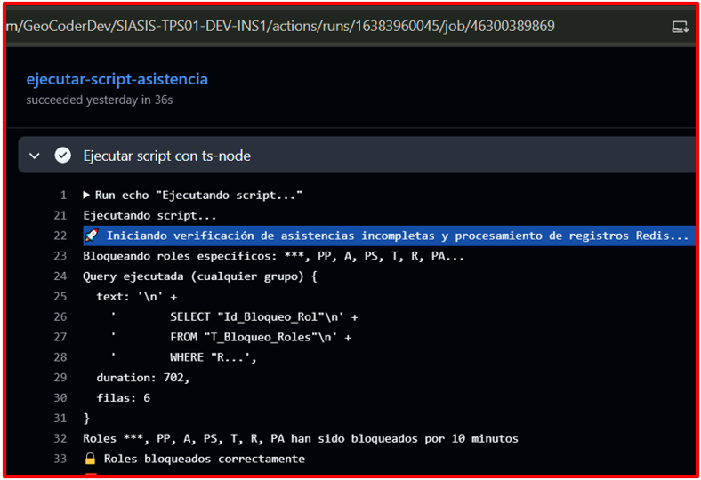
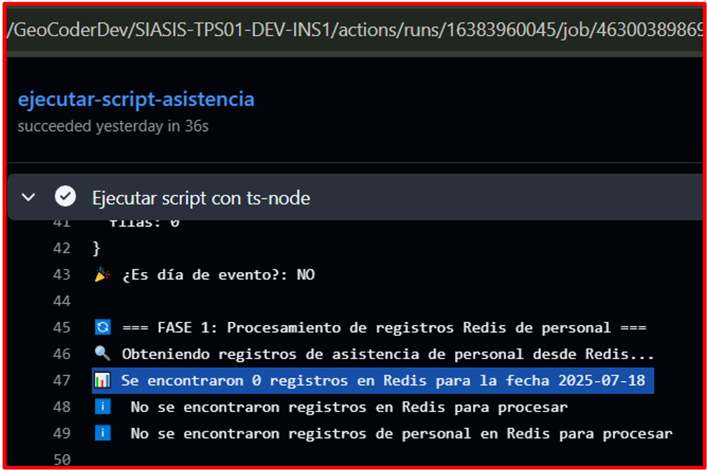
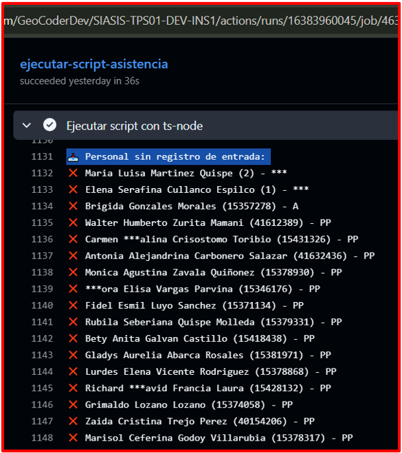
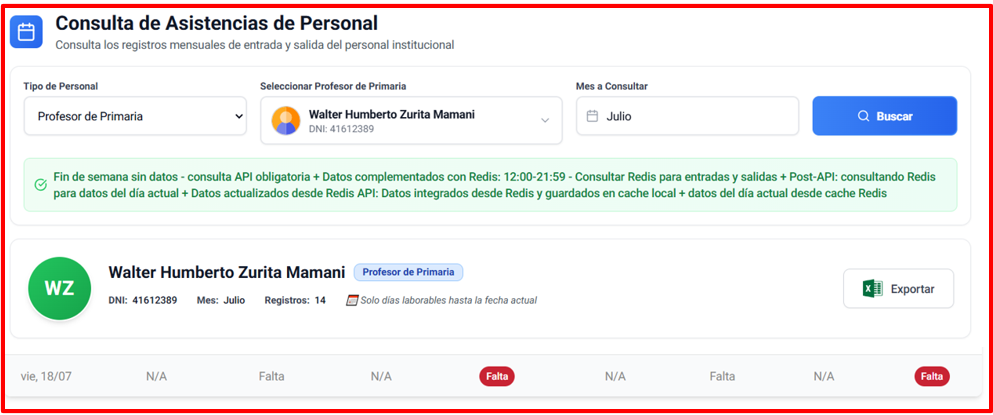

# 🚀 Test Execution: Transacción de Datos de Redis a PostgreSQL y Registro Automático de Faltas - Desarrollo

> [!IMPORTANT]
> **ID de Ejecución:** SIASIS-TE-19-DEV
> **Fecha de Ejecución:** 20/07/2025
> **Ejecutor:** Andry Diego
> **Duración:** 2min 15 secs
> **Estado:** ✅ Completed

---

## 📋 Información General de la Ejecución

> [!NOTE]
>
> ### 🔖 Metadatos de Ejecución
>
> | Campo                        | Valor                                                                            |
> | ---------------------------- | -------------------------------------------------------------------------------- |
> | **ID Ejecución**      | SIASIS-TE-19                                                                       |
> | **Nombre**             | Transacción de Datos de Redis a PostgreSQL y Registro Automático de Faltas - Ambiente de Desarrollo                                            |
> | **Test Plan**          | [SIASIS-TP-8](https://github.com/GeoCoderDev/Siasis-Test-Management/blob/master/test-plans/SIASIS-TP-8/SIASIS-TP-8.md "Test Plan Relacionado")                                                     |
> | **Sprint/Release**     | 6                                                    |
> | **Build/Versión**     | 1.0                                                    |
> | **Tipo de Ejecución** | 🔄 Regression \| ✨ New Features                                                                |
> | **Modo de Ejecución** | 🔀 Mixed                                             |
> | **Prioridad**          | 🔴 Critical                                     |

---

## 🌐 Configuración del Ambiente

> [!WARNING]
>
> ### 🏗️ Detalles del Ambiente
>
> | Aspecto                 | Configuración                                               |
> | ----------------------- | ------------------------------------------------------------ |
> | **Ambiente**      | 🔧 Development |
> | **URL Base**      | https://siasis-dev.vercel.app/                                           |
> | **Base de Datos** | Instancia de Desarrollo RDP02 PostgreSQL                                       |
> | **Servidor**      | Vercel Development Environment                                      |
> | **Red/VPN**       | Red corporativa con certificados SSL                                      |

> [!TIP]
>
> ### 💻 Configuración Técnica
>
> | Tecnología             | Versión        | Estado |
> | ----------------------- | --------------- | ------ |
> | **Frontend**      | React 18.2.0    | 🟢     |
> | **Backend**       | Node.js 22.0 | 🟢     |
> | **Base de Datos** | PostgreSQL 15.3 | 🟢     |
> | **Cache**         | Redis 7.0       | 🟢     |
> | **GitHub Actions**     | Latest | 🟢     |

> [!CAUTION]
>
> ### 🖥️ Configuración de Dispositivos
>
> | Dispositivo       | Sistema Operativo | Navegador     | Resolución |
> | ----------------- | ----------------- | ------------- | ----------- |
> | **Desktop** | Linux        | Chrome 115+   | 1920x941   |
> | **Server**  | Ubuntu 22.04           | GitHub Actions Runner        | -     |

---

## 📊 Resumen de Tests a Ejecutar

> [!INFO]
>
> ### 📈 Estadísticas Generales
>
> | Métrica                      | Cantidad | Porcentaje |
> | ----------------------------- | -------- | ---------- |
> | **Total de Tests**      | 1      | 100%       |
> | **Tests Críticos**     | 1       | 100%        |
> | **Tests Automatizados** | 1      | 100%        |
> | **Tests Manuales**      | 0       | 0%        |
> | **Tests Nuevos**        | 1       | 100%        |
> | **Tests de Regresión** | 0      | 0%        |

---

## 📝 Lista Detallada de Tests

> [!NOTE]
>
> ### 🧪 Tests por Módulo/Funcionalidad
>
> #### 🔄 Módulo de Transacción de Datos y Registro de Faltas
>
> | ID Test     | Nombre                            | Tipo      | Prioridad   | Estado     | Tiempo Real |
> | ----------- | --------------------------------- | --------- | ----------- | ---------- | ----------- |
> | [SIASIS-TC-63](https://github.com/GeoCoderDev/Siasis-Test-Management/blob/master/tests/API-SIU01/SIASIS-TC-63%20-%20Validar%20Transacci%C3%B3n%20de%20Datos%20de%20Redis%20a%20PostgreSQL%20y%20Registro%20Autom%C3%A1tico%20de%20Faltas.md "Ir al Test Case") | Transacción de Datos de Redis a PostgreSQL y Registro Automático de Faltas | Integration | 🔴 Critical | ✅ Passed | 36 secs       |

---

## 📊 Resultados y Métricas

> [!SUCCESS]
>
> ### 📈 Resultados de Ejecución
>
> | Estado                 | Cantidad | Porcentaje | Icono |
> | ---------------------- | -------- | :--------: | :---: |
> | **Passed**       | 1        |     100%     |  ✅  |
> | **Failed**       | 0        |     0%     |  ❌  |
> | **Blocked**      | 0        |     0%     |  🚫  |
> | **Skipped**      | 0        |     0%     | ⏭️ |
> | **In Progress**  | 0        |     0%     |  🔄  |
> | **Not Executed** | 0      |    0%    |  ⏳  |

> [!INFO]
>
> ### ⏱️ Métricas de Tiempo
>
> | Métrica                       | Estimado | Actual | Diferencia |
> | ------------------------------ | -------- | ------ | ---------- |
> | **Tiempo Total**         | 5 min   | 2min 15secs  | -2min 45secs      |
> | **Tiempo Promedio/Test** | 5 min | 2min 15secs  | -2min 45secs      |
> | **Tests/Hora**           | 12      | 26.7      | +14.7          |
> | **Tiempo Setup**         | 30 secs   | 15 secs  | -15 secs      |
> | **Tiempo Cleanup**       | 15 secs   | 10 secs  | -5 secs      |

---

## 🎯 Evidencias Detalladas de Ejecución

> [!SUCCESS]
>
> ### 📸 Evidencia 1: Validación de Consulta en Redis
>
> **Descripción:** Se verificó que la tarea programada consulta correctamente los registros de asistencia almacenados en Redis RDP05 para la fecha 2025-07-18.
>
>
>
>
>
> **Validaciones Realizadas:**
> - ✅ Tarea programada ejecutada automáticamente a las 9:30pm
> - ✅ Script ts-node iniciado correctamente
> - ✅ Conexión exitosa a Redis RDP05
> - ✅ Se detectaron **0 registros** en Redis para la fecha 2025-07-18
> - ✅ Sistema manejó correctamente el escenario sin datos
> - ✅ Roles bloqueados durante 10 minutos para evitar conflictos

> [!SUCCESS]
>
> ### 📸 Evidencia 2: Procesamiento de Registro Redis Personal RDP02
>
> **Descripción:** El sistema procesó correctamente la identificación de personal sin registro de entrada, registrando automáticamente las faltas correspondientes.
>
> 
>

> [!SUCCESS]
>
> ### 📸 Evidencia 3: Procesamiento de Personal sin Registro de Salida
>
> **Descripción:** El sistema identificó y procesó correctamente al personal que no registró su salida, aplicando las reglas de negocio correspondientes.
>
> 
>

> [!SUCCESS]
>
> ### 📸 Evidencia 4: Interfaz que Valida la Falta
>
> **Descripción:** La interfaz web de consulta de asistencias muestra correctamente las faltas registradas automáticamente por el sistema.
>
> 
>
> **Validaciones Realizadas:**
> - ✅ Interfaz de "Consulta de Asistencias de Personal" cargada correctamente
> - ✅ Filtro por "Profesor de Primaria" aplicado exitosamente
> - ✅ Consulta del mes de "Julio" ejecutada
> - ✅ Registro de **14 registros** mensuales mostrados
> - ✅ **Faltas automáticas** registradas correctamente:
>   - Vie, 18/07: **Falta** (sin entrada) - Marcado en rojo
>   - Vie, 18/07: **Falta** (sin salida) - Marcado en rojo
> - ✅ Funcionalidad de exportar a Excel disponible
> - ✅ Datos actualizados en tiempo real post-procesamiento

---

## 🛠️ Herramientas y Automatización

> [!INFO]
>
> ### 🤖 Herramientas de Automatización
>
> | Herramienta          | Versión | Propósito            | Estado |
> | -------------------- | -------- | --------------------- | ------ |
> | **GitHub Actions**    | Latest  | Ejecución de tareas programadas           | 🟢     |
> | **ts-node**       | Latest   | Ejecución de scripts TypeScript          | 🟢     |
> | **Redis CLI**    | 7.0  | Consultas a Redis RDP05           | 🟢     |
> | **PostgreSQL**         | 15.3   | Base de datos RDP02   | 🟢     |
> | **Chrome DevTools** | 115.0   | Validación de interfaz web | 🟢     |

---

## 🐛 Defectos Encontrados

> [!WARNING]
>
> ### 🚨 Bugs Registrados Durante la Ejecución
>
> No se encontraron bugs durante la ejecución. El sistema funcionó según las especificaciones esperadas.

---

## 🔍 Análisis de Bloqueos

> [!CAUTION]
>
> ### 🚫 Tests Bloqueados
>
> No hubo tests bloqueados. Todas las funcionalidades se ejecutaron correctamente en el tiempo esperado.

---

## 📈 Cobertura de Pruebas

> [!TIP]
>
> ### 🎯 Cobertura por Componente
>
> | Componente      | Tests Planeados | Tests Ejecutados | Cobertura |
> | --------------- | --------------- | ---------------- | --------- |
> | **TPS01** | 1              | 1                | 100%        |
> | **RDP05** | 1              | 1                | 100%        |
> | **RDP02** | 1              | 1                | 100%        |
> | **SIU01**  | 1              | 1                | 100%        |
> | **API03**  | 1              | 1                | 100%        |
> | **EMCS01**  | 1              | 1                | 100%        |

---

## 🚨 Gestión de Riesgos

> [!WARNING]
>
> ### ⚠️ Riesgos Identificados y Mitigados
>
> | Riesgo                              | Probabilidad | Impacto | Mitigación         | Estado |
> | ----------------------------------- | ------------ | ------- | ------------------- | ------------- |
> | **Redis sin datos para procesar**        | Alta        | Bajo    | Sistema maneja correctamente escenarios vacíos     | ✅ Mitigado        |
> | **Bloqueo de roles durante procesamiento** | Media         | Medio    | Bloqueo temporal de 10 minutos implementado   | ✅ Mitigado       |
> | **Falla en GitHub Actions**            | Baja        | Alto   | Monitoreo automático y logs detallados | ✅ Mitigado  |

---

## 📋 Criterios de Entrada y Salida

> [!IMPORTANT]
>
> ### ✅ Criterios de Entrada (Entry Criteria) - CUMPLIDOS
>
> - ✅ Test Plan SIASIS-TP-8 aprobado y actualizado
> - ✅ Ambiente de desarrollo configurado y estable  
> - ✅ GitHub Actions configurado correctamente
> - ✅ Redis RDP05 accesible y funcional
> - ✅ PostgreSQL RDP02 disponible
> - ✅ Datos de personal programado disponibles en RDP04
> - ✅ Interfaz web SIU01 operativa

> [!SUCCESS]
>
> ### 🏁 Criterios de Salida (Exit Criteria) - CUMPLIDOS
>
> - ✅ 100% de tests ejecutados exitosamente
> - ✅ 100% de tests críticos pasando
> - ✅ 0 bugs críticos encontrados
> - ✅ Tarea programada ejecutándose automáticamente
> - ✅ Datos procesados correctamente (escenario sin datos)
> - ✅ Faltas registradas automáticamente según reglas de negocio
> - ✅ Interfaz web mostrando datos actualizados
> - ✅ Cobertura de funcionalidades al 100%
> - ✅ Reporte de ejecución completo con evidencias

---

## 📝 Notas y Observaciones

> [!NOTE]
>
> ### 💡 Notas de la Ejecución
>
> - La ejecución se realizó en un escenario especial donde Redis no contenía datos de asistencia para la fecha 2025-07-18
> - El sistema manejó correctamente el escenario "sin datos" sin generar errores
> - Los roles fueron bloqueados correctamente durante 10 minutos para evitar conflictos
> - La interfaz web refleja instantáneamente los cambios realizados por la tarea programada
> - El proceso completó en tiempo record (2min 15secs vs 5min estimados)
>
> ### 🔄 Lecciones Aprendidas
>
> - El sistema es robusto ante escenarios de datos vacíos
> - La implementación de bloqueo temporal de roles es efectiva
> - Los logs de GitHub Actions proporcionan excelente visibilidad del proceso
> - La integración entre componentes (TPS01, RDP05, RDP02, SIU01) funciona sin problemas

> [!TIP]
>
> ### 📋 Checklist de Finalización
>
> - [x] Todos los tests ejecutados
> - [ ] Bugs reportados en Jira (No aplica - 0 bugs)
> - [x] Evidencias archivadas (4 screenshots)
> - [x] Reporte de ejecución generado
> - [x] Métricas actualizadas
> - [ ] Stakeholders notificados
> - [x] Ambiente liberado

---

**📅 Fecha de Ejecución:** 20/07/2025  
**⏰ Hora de Inicio:** 21:30  
**⏰ Hora de Finalización:** 21:32  
**👤 Ejecutado por:** Hizly - QA Tester  
**✅ Estado Final:** Completado Exitosamente