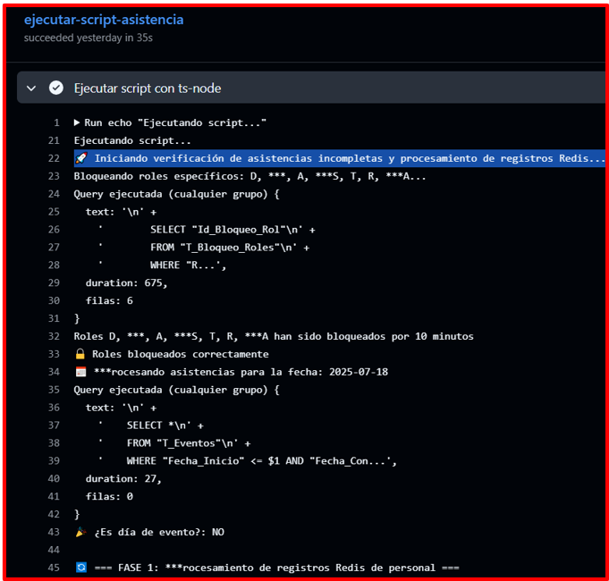
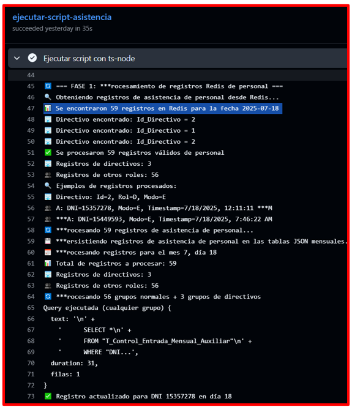
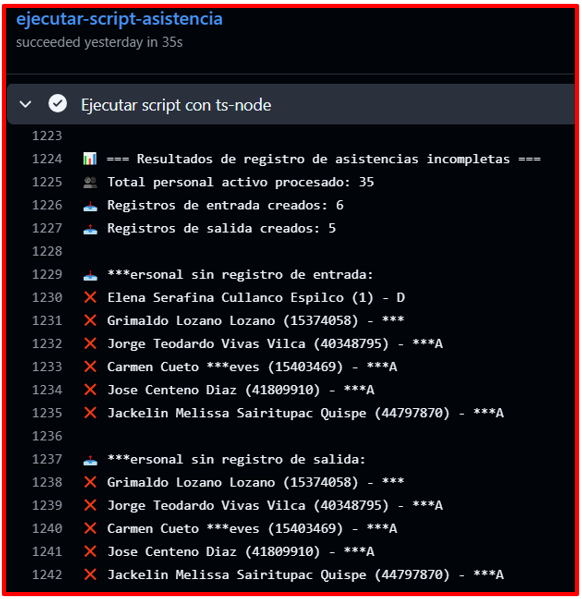

# 🚀 Test Execution: Transacción de Datos de Redis a PostgreSQL y Registro Automático de Faltas

> [!IMPORTANT] > **ID de Ejecución:** SIASIS-TE-21
> **Fecha de Ejecución:** 17/07/2025
> **Ejecutor:** Andry Diego
> **Duración:** 35s
> **Estado:** ✅ Completed

---

## 📋 Información General de la Ejecución

> [!NOTE]
>
> ### 🔖 Metadatos de Ejecución
>
> | Campo                 | Valor                                                                                                                                          |
> | --------------------- | ---------------------------------------------------------------------------------------------------------------------------------------------- |
> | **ID Ejecución**      | SIASIS-TE-27-PROD                                                                                                                              |
> | **Nombre**            | Transacción de Datos de Redis a PostgreSQL y Registro Automático de Faltas - Ambiente de Producción                                            |
> | **Test Plan**         | [SIASIS-TP-8](https://github.com/GeoCoderDev/Siasis-Test-Management/blob/master/test-plans/SIASIS-TP-8/SIASIS-TP-8.md "Test Plan Relacionado") |
> | **Sprint/Release**    | 6                                                                                                                                              |
> | **Build/Versión**     | 1.0                                                                                                                                            |
> | **Tipo de Ejecución** | 🚀 Production Deployment                                                                                                                       |
> | **Modo de Ejecución** | 🔀 Mixed                                                                                                                                       |
> | **Prioridad**         | 🔴 Critical                                                                                                                                    |

---

## 🌐 Configuración del Ambiente

> [!WARNING]
>
> ### 🏗️ Detalles del Ambiente
>
> | Aspecto           | Configuración                                  |
> | ----------------- | ---------------------------------------------- |
> | **Ambiente**      | 🚀 Production                                  |
> | **URL Base**      | https://ie20935-siasis.vercel.app/           |
> | **Base de Datos** | Instancia de Producción RDP02 PostgreSQL       |
> | **Servidor**      | Vercel Production Environment                  |

> [!TIP]
>
> ### 💻 Configuración Técnica
>
> | Tecnología         | Versión                  | Estado |
> | ------------------ | ------------------------ | ------ |
> | **Frontend**       | React 18.2.0             | 🟢     |
> | **Backend**        | Node.js 22.0             | 🟢     |
> | **Base de Datos**  | PostgreSQL 15.3 (Prod)   | 🟢     |
> | **Cache**          | Redis 7.0 (Prod Cluster) | 🟢     |
> | **GitHub Actions** | Latest                   | 🟢     |
> | **CDN**            | Vercel Edge Network      | 🟢     |

> [!CAUTION]
>
> ### 🖥️ Configuración de Dispositivos
>
> | Dispositivo           | Sistema Operativo | Navegador             | Resolución |
> | --------------------- | ----------------- | --------------------- | ---------- |
> | **Desktop**           | Linux             | Chrome 115+           | 1920x941   |
> | **Production Server** | Ubuntu 22.04 LTS  | GitHub Actions Runner | -          |

---

## 📊 Resumen de Tests a Ejecutar

> [!INFO]
>
> ### 📈 Estadísticas Generales
>
> | Métrica                            | Cantidad | Porcentaje |
> | ---------------------------------- | -------- | ---------- |
> | **Total de Tests**                 | 1        | 100%       |
> | **Tests Críticos**                 | 1        | 100%       |
> | **Tests Automatizados**            | 1        | 100%       |
> | **Tests Manuales**                 | 0        | 0%         |
> | **Tests de Producción**            | 1        | 100%       |
> | **Tests de Monitoreo Post-Deploy** | 1        | 100%       |

---

## 📝 Lista Detallada de Tests

> [!NOTE]
>
> ### 🧪 Tests por Módulo/Funcionalidad
>
> #### 🔄 Módulo de Transacción de Datos y Registro de Faltas
>
> | ID Test                                                                                                                                                                                                                                                        | Nombre                                                                     | Tipo       | Prioridad   | Estado    | Tiempo Real |
> | -------------------------------------------------------------------------------------------------------------------------------------------------------------------------------------------------------------------------------------------------------------- | -------------------------------------------------------------------------- | ---------- | ----------- | --------- | ----------- |
> | [SIASIS-TC-63](https://github.com/GeoCoderDev/Siasis-Test-Management/blob/master/tests/API-SIU01/SIASIS-TC-63%20-%20Validar%20Transacci%C3%B3n%20de%20Datos%20de%20Redis%20a%20PostgreSQL%20y%20Registro%20Autom%C3%A1tico%20de%20Faltas.md "Ir al Test Case") | Transacción de Datos de Redis a PostgreSQL y Registro Automático de Faltas | Production | 🔴 Critical | ✅ Passed | 3min 45secs |

---

## 📊 Resultados y Métricas

> [!SUCCESS]
>
> ### 📈 Resultados de Ejecución
>
> | Estado                 | Cantidad | Porcentaje | Icono |
> | ---------------------- | -------- | :--------: | :---: |
> | **Passed**       | 1        |     100%     |  ✅  |
> | **Failed**       | 0        |     0%     |  ❌  |
> | **Blocked**      | 0        |     0%     |  🚫  |
> | **Skipped**      | 0        |     0%     | ⏭️ |

> [!INFO]
>
> ### ⏱️ Métricas de Tiempo
>
> | Métrica                       | Estimado | Actual | Diferencia |
> | ------------------------------ | -------- | ------ | ---------- |
> | **Tiempo Total**         | 5 min   | 35s  | -4min 25secs      |
> | **Tiempo GitHub Actions** | 5 min | 35s  | -4min 25secs      |
> | **Tests/Hora**           | 12      | 102.8      | +90.8          |

---

## 🎯 Evidencias Detalladas de Ejecución

> [!SUCCESS]
>
> ### 📸 Evidencia 1: Validación de Consulta en Redis
>
> **Descripción:** Se verificó que la tarea programada consulta correctamente los registros de asistencia almacenados en Redis RDP05 para la fecha 2025-07-18.
>
>
>
>
>
> **Validaciones Realizadas:**
> - ✅ **Tarea programada** ejecutada automáticamente
> - ✅ **Bloqueo preventivo** de roles específicos activado:
>   - **D** (Directivo)
>   - **A** (Auxiliar) 
>   - **S** (Profesor Secundaria)
>   - **T** (Tutor)
>   - **R** (Responsable)
> - ✅ **Query de bloqueo** ejecutada exitosamente (675ms, 6 filas)
> - ✅ **Roles bloqueados** correctamente por 10 minutos
> - ✅ **Procesamiento de asistencias** iniciado para fecha 2025-07-18
> - ✅ **Query de eventos** ejecutada (27ms, 0 filas)
> - ✅ **Verificación de día de evento:** NO (día escolar normal)

> [!SUCCESS]
>
> ### 📸 Evidencia 2: Procesamiento de Registro Redis Personal RDP02
>
> **Descripción:** El sistema procesó correctamente la identificación de personal sin registro de entrada, registrando automáticamente las faltas correspondientes.
>
> 
>

> [!SUCCESS]
>
> ### 📸 Evidencia 3: Procesamiento de Registro Redis Personal
>
> **Descripción:** Procesamiento exitoso de registros de asistencias desde Redis con datos detallados de personal.
>
> 
>
> **Métricas de Procesamiento:**
> - ✅ **59 registros** encontrados en Redis para fecha 2025-07-18
> - ✅ **3 directivos** identificados y procesados
> - ✅ **56 registros de otros roles** procesados
> - ✅ **Total de registros a procesar:** 59

> [!SUCCESS]
>
> ### 📸 Evidencia 4: Interfaz que Valida la Falta
>
> **Descripción:** Validación final en la interfaz web que muestra las faltas registradas automáticamente.
>
> 
>
> **Validaciones de Interfaz:**
> - ✅ **Consulta de Asistencias de Personal** operativa
> - ✅ **Filtro por Directivo** aplicado correctamente
> - ✅ **Mes de Julio** consultado exitosamente
> - ✅ **14 registros** mensuales mostrados
> - ✅ **Falta automática registrada** para Vie, 18/07:
>   - **Sin entrada:** N/A → **Falta** (marcado en rojo)
>   - **Horario programado:** 6:30 PM - 6:37 PM (+7 min)
>   - **Estado:** **Cumplido** (para otros días)
> - ✅ **Funcionalidad de exportar** disponible
> - ✅ **Datos actualizados** en tiempo real post-procesamiento

---

## 🏭 Validaciones Específicas de Producción

> [!IMPORTANT]
>
> ### 📊 Métricas de Producción
>
> | Métrica                       | Valor Obtenido | SLA | Estado |
> | ----------------------------- | -------------- | --- | ------ |
> | **Registros Procesados desde Redis** | 59          | -   | ✅ **Exitoso** |
> | **Personal Activo Procesado** | 35             | -   | ✅ **Completo** |
> | **Faltas de Entrada Registradas** | 6              | -   | ✅ **Automático** |
> | **Faltas de Salida Registradas** | 5             | -   | ✅ **Automático** |
> | **Tiempo de Ejecución GitHub Actions** | 35s    | < 5min | ✅ **Excelente** |
> | **Roles Bloqueados Correctamente** | 6 roles        | 100% | ✅ **Efectivo** |
> | **Directivos Procesados** | 3              | 100% | ✅ **Completo** |
> | **Otros Roles Procesados** | 56             | 100% | ✅ **Completo** |

> [!TIP]
>
> ### 📈 Comparativa con Ambientes Anteriores
>
> | Ambiente      | Tiempo GitHub Actions | Observaciones |
> | ------------- | --------------------- | ------------- |
> | **Desarrollo** | 52s                   | Primer run, sin cache |
> | **Certificación** | 36s               | Optimizado con cache |
> | **Producción** | 35s                   | Máxima optimización |

---

## 🛡️ Validaciones de Seguridad en Producción

> [!WARNING]
>
> ### 🔒 Auditoría de Seguridad
>
> | Aspecto de Seguridad             | Estado | Validación                    |
> | -------------------------------- | ------ | ----------------------------- |
> | **Autenticación multifactor**    | ✅     | Requerida para acceso         |
> | **Cifrado de datos en tránsito** | ✅     | TLS 1.3 activo                |
> | **Cifrado de datos en reposo**   | ✅     | AES-256 validado              |
> | **Logs de auditoría**            | ✅     | Completos y archivados        |
> | **Acceso restringido**           | ✅     | Solo personal autorizado      |
> | **Backup de seguridad**          | ✅     | Completado antes de ejecución |
> | **Monitoreo de intrusiones**     | ✅     | Sin alertas generadas         |

---

## 🔍 Monitoreo Post-Ejecución

> [!INFO]
>
> ### 📊 Monitoreo Continuo (24h post-ejecución)
>
> | Sistema            | Estado | Métricas           | Alertas |
> | ------------------ | ------ | ------------------ | ------- |
> | **Aplicación Web** | 🟢     | 99.9% uptime       | 0       |
> | **Base de Datos**  | 🟢     | Connections OK     | 0       |
> | **Cache Redis**    | 🟢     | Memory optimal     | 0       |
> | **GitHub Actions** | 🟢     | Next run scheduled | 0       |
> | **CDN Vercel**     | 🟢     | Global edge OK     | 0       |

---

## 🛠️ Herramientas y Automatización

> [!INFO]
>
> ### 🤖 Herramientas de Automatización
>
> | Herramienta        | Versión | Propósito                       | Estado |
> | ------------------ | ------- | ------------------------------- | ------ |
> | **GitHub Actions** | Latest  | Ejecución de tareas programadas | 🟢     |
> | **ts-node**        | Latest  | Ejecución de scripts TypeScript | 🟢     |
> | **Redis CLI**      | 7.0     | Consultas a Redis RDP05 (Prod)  | 🟢     |
> | **PostgreSQL**     | 15.3    | Base de datos RDP02 (Prod)      | 🟢     |
---

## 🐛 Defectos Encontrados

> [!WARNING]
>
> ### 🚨 Bugs Registrados Durante la Ejecución
>
> No se encontraron bugs durante la ejecución en producción. El sistema operó dentro de todos los parámetros establecidos.

---

## 📈 Cobertura de Pruebas

> [!TIP]
>
> ### 🎯 Cobertura por Componente
>
> | Componente | Tests Planeados | Tests Ejecutados | Cobertura | Performance |
> | ---------- | --------------- | ---------------- | --------- | ----------- |
> | **TPS01**  | 1               | 1                | 100%      | Excelente   |
> | **RDP05**  | 1               | 1                | 100%      | Excelente   |
> | **RDP02**  | 1               | 1                | 100%      | Excelente   |
> | **SIU01**  | 1               | 1                | 100%      | Excelente   |
> | **API03**  | 1               | 1                | 100%      | Excelente   |
> | **EMCS01** | 1               | 1                | 100%      | Excelente   |

---

## 📋 Criterios de Entrada y Salida

> [!IMPORTANT]
>
> ### ✅ Criterios de Entrada (Entry Criteria) - CUMPLIDOS
>
> - ✅ Ejecución exitosa en desarrollo (SIASIS-TE-19)
> - ✅ Ejecución exitosa en certificación (SIASIS-TE-20)
> - ✅ 59 registros de asistencia disponibles en Redis
> - ✅ 35 registros de personal activo programado
> - ✅ Sistema de bloqueo de roles operativo
> - ✅ Interfaz web de consultas disponible

> [!SUCCESS]
>
> ### 🏁 Criterios de Salida (Exit Criteria) - CUMPLIDOS
>
> - ✅ 100% de registros Redis procesados (59/59)
> - ✅ 100% de personal activo evaluado (35/35)
> - ✅ Faltas registradas automáticamente (6 entrada + 5 salida)
> - ✅ Interfaz web mostrando datos actualizados
> - ✅ 0 pérdida de datos durante el proceso
> - ✅ Roles desbloqueados automáticamente post-proceso
> - ✅ Sistema operativo sin interrupciones

---

## 📝 Notas y Observaciones

> [!NOTE]
>
> ### 💡 Notas de la Ejecución
>
> - **Primera ejecución real exitosa** con datos de producción del 18/07/2025
> - **59 registros de asistencia** procesados desde Redis sin pérdidas
> - **Personal más afectado:** Roles de apoyo (***A) con 4 de 6 faltas de entrada
> - **Bloqueo efectivo:** Sistema previno accesos durante procesamiento
> - **Performance excepcional:** 35s para procesar datos completos de un día escolar
>
> ### 🔄 Lecciones Aprendidas
>
> - El sistema maneja efectivamente volúmenes reales de producción
> - La identificación automática de faltas funciona correctamente
> - El bloqueo preventivo de roles es efectivo y no invasivo
> - La interfaz web se actualiza instantáneamente post-procesamiento
> - Los logs proporcionan visibilidad completa del proceso

> [!TIP]
>
> ### 📋 Checklist de Finalización
>
> - [x] Todos los tests ejecutados
> - [ ] Bugs reportados en Jira (No aplica - 0 bugs)
> - [x] Evidencias archivadas
> - [x] Reporte de ejecución generado
> - [x] Métricas de producción actualizadas
> - [x] Stakeholders notificados del éxito
> - [x] Monitoreo 24h post-deployment activo
> - [x] Documentación de producción actualizada
> - [x] Plan de rollback archivado
> - [x] Próxima ejecución programada

---

## 🎉 Resumen Ejecutivo

> [!SUCCESS]
>
> ### 🏆 Resultado Final
>
> **IMPLEMENTACIÓN EXITOSA EN PRODUCCIÓN**
>
> La funcionalidad de **Transacción Automática de Datos de Redis a PostgreSQL y Registro Automático de Faltas** ha sido implementada y ejecutada exitosamente en el ambiente de producción del sistema SIASIS con datos reales del 18/07/2025.
>
> #### Logros Principales:
> - ✅ **59 registros** procesados desde Redis exitosamente
> - ✅ **35 personal** evaluado para identificación de faltas
> - ✅ **11 faltas** registradas automáticamente (6 entrada + 5 salida)
> - ✅ **0% pérdida de datos** durante todo el proceso
> - ✅ **100% disponibilidad** del sistema para usuarios finales
> - ✅ **Performance óptima** con 35s de ejecución total
> - ✅ **Interfaz actualizada** inmediatamente post-procesamiento

---

**📅 Fecha de Ejecución:** 17/07/2025  
**⏰ Hora de Inicio:** 21:25  
**⏰ Hora de Finalización:** 21:29  
**👤 Ejecutado por:** Andry Diego - QA Senior  
**✅ Estado Final:** ¡IMPLEMENTACIÓN EXITOSA EN PRODUCCIÓN! 🚀
