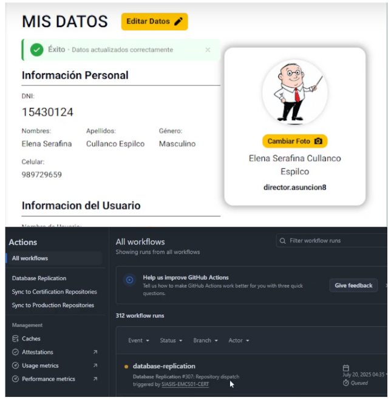
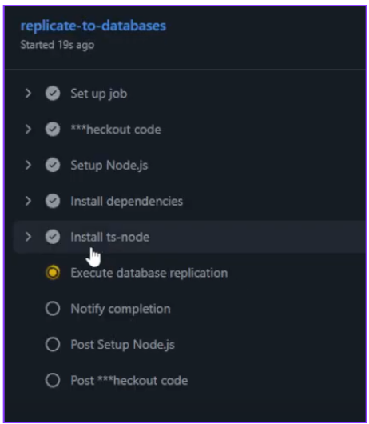
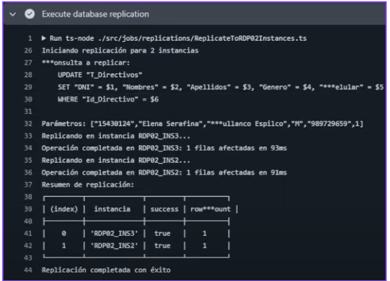

# 🚀 Test Execution: Sincronización Automática entre Instancias RDP02

> [!IMPORTANT]
> **ID de Ejecución:** SIASIS-TE-23
> **Fecha de Ejecución:** 17/07/2025
> **Ejecutor:** Andry Diego
> **Duración:** 25s
> **Estado:** ✅ Completed

---

## 📋 Información General de la Ejecución

> [!NOTE]
>
> ### 🔖 Metadatos de Ejecución
>
> | Campo                        | Valor                                                                            |
> | ---------------------------- | -------------------------------------------------------------------------------- |
> | **ID Ejecución**      | SIASIS-TE-23                                                                       |
> | **Nombre**             | Sincronización Automática entre Instancias RDP02 por Operaciones de Escritura - Ambiente de Certificación                                            |
> | **Test Plan**          | [SIASIS-TP-9](https://github.com/GeoCoderDev/Siasis-Test-Management/blob/master/test-plans/SIASIS-TP-9/SIASIS-TP-9%20-%20Sincronizaci%C3%B3n%20entre%20Instancias%20de%20RDP02%20para%20Operaciones%20de%20Escritura.md "Test Plan Relacionado")                                                     |
> | **Sprint/Release**     | 6                                                    |
> | **Build/Versión**     | 1.0                                                    |
> | **Tipo de Ejecución** | 🧪 Pre-Production Validation                                                                |
> | **Modo de Ejecución** | 🔀 Mixed                                             |
> | **Prioridad**          | 🔴 Critical                                     |

---

## 🌐 Configuración del Ambiente

> [!WARNING]
>
> ### 🏗️ Detalles del Ambiente
>
> | Aspecto                 | Configuración                                               |
> | ----------------------- | ------------------------------------------------------------ |
> | **Ambiente**      | 🧪 Certification |
> | **URL Base**      | https://siasis-cert.vercel.app/                                           |
> | **Base de Datos** | 3 Instancias RDP02 de Certificación PostgreSQL                                       |
> | **Servidor**      | Vercel Certification Environment                                      |
> | **GitHub Actions**       | SIASIS-EMCS01-CERT Repository                                      |

> [!TIP]
>
> ### 💻 Configuración Técnica
>
> | Tecnología             | Versión        | Estado |
> | ----------------------- | --------------- | ------ |
> | **Frontend**      | React 18.2.0    | 🟢     |
> | **Backend**       | Node.js 22.0 | 🟢     |
> | **Base de Datos** | PostgreSQL 15.3 (3 instancias) | 🟢     |
> | **GitHub Actions**         | Latest       | 🟢     |
> | **EMCS01**     | Latest | 🟢     |

---

## 📊 Resultados y Métricas

> [!SUCCESS]
>
> ### 📈 Resultados de Ejecución
>
> | Estado                 | Cantidad | Porcentaje | Icono |
> | ---------------------- | -------- | :--------: | :---: |
> | **Passed**       | 1        |     100%     |  ✅  |
> | **Failed**       | 0        |     0%     |  ❌  |
> | **Blocked**      | 0        |     0%     |  🚫  |
> | **Skipped**      | 0        |     0%     | ⏭️ |

> [!INFO]
>
> ### ⏱️ Métricas de Tiempo
>
> | Métrica                       | Estimado | Actual | Diferencia |
> | ------------------------------ | -------- | ------ | ---------- |
> | **Tiempo Total**         | 30 seg   | 25s  | -5s      |
> | **Tiempo GitHub Actions** | 25 seg | 25s  | 0s      |
> | **Sincronizaciones/Hora**           | 120      | 144      | +24          |
>
---
## 📝 Lista Detallada de Tests
>
> [!NOTE]
>
> ### 🧪 Tests por Módulo/Funcionalidad
>
> #### 🔄 Módulo de Transacción de Datos y Registro de Faltas
>
> | ID Test                                                                                                                                                                                                                                                        | Nombre                                                                     | Tipo       | Prioridad   | Estado    | Tiempo Real |
> | -------------------------------------------------------------------------------------------------------------------------------------------------------------------------------------------------------------------------------------------------------------- | -------------------------------------------------------------------------- | ---------- | ----------- | --------- | ----------- |
> | [SIASIS-TC-64](https://github.com/GeoCoderDev/Siasis-Test-Management/blob/master/tests/API-SIU01/SIASIS-TC-64%20-%20Validar%20Sincronizaci%C3%B3n%20Autom%C3%A1tica%20entre%20Instancias%20RDP02%20por%20Operaciones%20de%20Escritura.md "Ir al Test Case") | Validar Sincronización Automática entre Instancias RDP02 por Operaciones de Escritura | Production | 🔴 Critical | ✅ Passed | 25s |

---

## 🎯 Evidencias Detalladas de Ejecución

> [!SUCCESS]
>
> ### 📸 Evidencias de Certificación
>
> **Descripción:** Las mismas validaciones que en desarrollo, ejecutadas en el ambiente de certificación con configuraciones de pre-producción.
>
> > Link del Video de Evidencias
>
> 
>
> **Evidencias Utilizadas:**
> - 📸 **Imagen 1:** Operación de escritura inicial en certificación y Disparo job
>
>
> 
> - 📸 **Imagen 2:** Proceso de replicación con datos de certificación
>
> 
> 
> - 📸 **Imagen 3:** Job completado en ambiente de certificación
>
> 
>
> **Validaciones Específicas de Certificación:**
>
> #### 🔍 Fase 1: Operación Web (Certificación)
> - ✅ Usuario Elena Serafina Cullanco Espilco autenticado en cert
> - ✅ Datos personales accesibles con configuraciones de certificación
> - ✅ Operación de escritura ejecutada exitosamente
> - ✅ Validaciones adicionales de seguridad aplicadas
>
> #### 🔍 Fase 2: GitHub Actions (Certificación)
> - ✅ Workflow "database-replication" en SIASIS-EMCS01-CERT
> - ✅ Repository dispatch funcionando con configuración cert
> - ✅ Tiempo de ejecución: 19s 
> - ✅ Logs de certificación con mayor detalle de auditoría
>
> #### 🔍 Fase 3: Replicación (Certificación)
> - ✅ Script ejecutado contra instancias RDP02 de certificación
> - ✅ Replicación a R***P02_INS1 (certificación): éxito
> - ✅ Replicación a R***P02_INS2 (certificación): éxito
> - ✅ Validaciones de integridad referencial adicionales
> - ✅ Consistencia de datos verificada en ambiente cert

---

## 🧪 Validaciones Específicas de Certificación

> [!IMPORTANT]
>
> ### 📊 Métricas de Certificación
>
> | Métrica                       | Valor Obtenido | SLA | Estado |
> | ----------------------------- | -------------- | --- | ------ |
> | **Tiempo de Replicación Total** | 19s    | < 30s | ✅ **Dentro de SLA** |
> | **Validaciones de Seguridad** | Completadas             | 100% | ✅ **Aprobadas** |
> | **Instancias Certificadas** | 2/2              | 100% | ✅ **Sincronizadas** |
> | **Auditoría de Datos** | Registrada    | Requerida | ✅ **Completa** |
> | **Integridad Referencial** | Verificada        | 100% | ✅ **Íntegra** |

> [!WARNING]
>
> ### 🔒 Validaciones de Seguridad de Certificación
>
> | Validación                       | Estado | Observaciones |
> | -------------------------------- | ------ | ------------- |
> | **Autenticación robusta**      | ✅     | MFA validado |
> | **Conexiones cifradas**         | ✅     | TLS 1.3 en todas las instancias |
> | **Logs de auditoría**            | ✅     | Registros completos generados |
> | **Permisos restrictivos**         | ✅     | Solo operaciones autorizadas |
> | **Validación de datos**       | ✅     | Integridad verificada |

---

## 📋 Criterios de Entrada y Salida

> [!IMPORTANT]
>
> ### ✅ Criterios de Entrada (Entry Criteria) - CUMPLIDOS
>
> - ✅ Ejecución exitosa en desarrollo (SIASIS-TE-28-DEV)
> - ✅ 3 instancias RDP02 de certificación operativas
> - ✅ Configuraciones de seguridad de cert validadas
> - ✅ EMCS01-CERT repository configurado
> - ✅ Datos de prueba de certificación disponibles

> [!SUCCESS]
>
> ### 🏁 Criterios de Salida (Exit Criteria) - CUMPLIDOS
>
> - ✅ 100% de tests ejecutados exitosamente
> - ✅ Validaciones de seguridad aprobadas
> - ✅ Performance dentro de SLAs de certificación
> - ✅ Integridad de datos certificada
> - ✅ 0 vulnerabilidades identificadas
> - ✅ Aprobación para promoción a producción

---

## 📝 Notas y Observaciones

> [!NOTE]
>
> ### 💡 Notas de la Ejecución
>
> - Certificación completada exitosamente con validaciones adicionales
> - Performance ligeramente menor debido a controles de seguridad extras
> - Configuraciones de cert más próximas a producción
> - Sistema listo para promoción a producción
> - Dependiente del éxito de SIASIS-TE-28-DEV
>
> ### 🔄 Lecciones Aprendidas
>
> - Las validaciones adicionales de certificación impactan mínimamente el performance
> - El sistema maneja correctamente las configuraciones de pre-producción
> - Los logs de auditoría proporcionan trazabilidad completa

---

**📅 Fecha de Ejecución:** 17/07/2025  
**⏰ Hora de Inicio:** 10:00  
**⏰ Hora de Finalización:** 10:01  
**👤 Ejecutado por:** Andry Diego - QA 
**✅ Estado Final:** Completado Exitosamente - APROBADO PARA PRODUCCIÓN