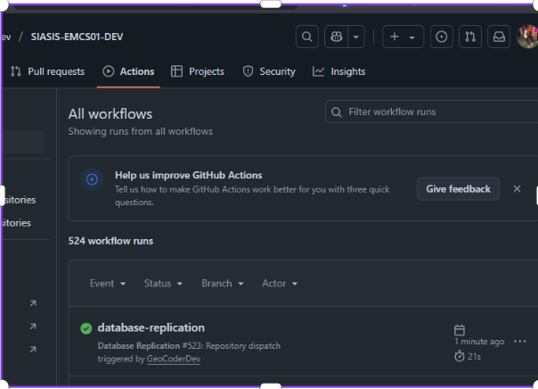
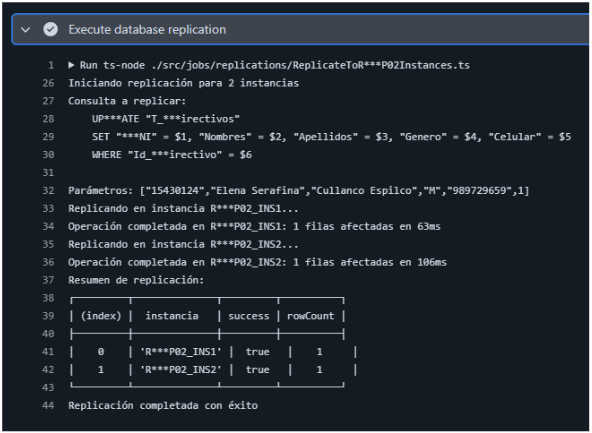
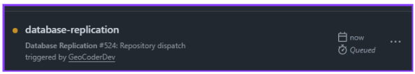

# 🚀 Test Execution: Sincronización Automática entre Instancias RDP02

> [!IMPORTANT]
> **ID de Ejecución:** SIASIS-TE-22
> **Fecha de Ejecución:** 17/07/2025
> **Ejecutor:** Andry Diego
> **Duración:** 21s
> **Estado:** ✅ Completed

---

## 📋 Información General de la Ejecución

> [!NOTE]
>
> ### 🔖 Metadatos de Ejecución
>
> | Campo                        | Valor                                                                            |
> | ---------------------------- | -------------------------------------------------------------------------------- |
> | **ID Ejecución**      | SIASIS-TE-22                                                                       |
> | **Nombre**             | Sincronización Automática entre Instancias RDP02 por Operaciones de Escritura - Ambiente de Desarrollo                                            |
> | **Test Plan**          | [SIASIS-TP-9](https://github.com/GeoCoderDev/Siasis-Test-Management/blob/master/test-plans/SIASIS-TP-9/SIASIS-TP-9%20-%20Sincronizaci%C3%B3n%20entre%20Instancias%20de%20RDP02%20para%20Operaciones%20de%20Escritura.md "Test Plan Relacionado")                                                     |
> | **Sprint/Release**     | 6                                                    |
> | **Build/Versión**     | 1.0                                                    |
> | **Tipo de Ejecución** | 🔄 Regression \| ✨ New Features                                                                |
> | **Modo de Ejecución** | 🔀 Mixed                                             |
> | **Prioridad**          | 🔴 Critical                                     |

---

## 🌐 Configuración del Ambiente

> [!WARNING]
>
> ### 🏗️ Detalles del Ambiente
>
> | Aspecto                 | Configuración                                               |
> | ----------------------- | ------------------------------------------------------------ |
> | **Ambiente**      | 🔧 Development |
> | **URL Base**      | https://siasis-dev.vercel.app/                                           |
> | **Base de Datos** | 3 Instancias RDP02 de Desarrollo PostgreSQL                                       |
> | **Servidor**      | Vercel Development Environment                                      |
> | **GitHub Actions**       | SIASIS-EMCS01-DEV Repository                                      |

> [!TIP]
>
> ### 💻 Configuración Técnica
>
> | Tecnología             | Versión        | Estado |
> | ----------------------- | --------------- | ------ |
> | **Frontend**      | React 18.2.0    | 🟢     |
> | **Backend**       | Node.js 22.0 | 🟢     |
> | **Base de Datos** | PostgreSQL 15.3 (3 instancias) | 🟢     |
> | **GitHub Actions**         | Latest       | 🟢     |
> | **EMCS01**     | Latest | 🟢     |

> [!CAUTION]
>
> ### 🖥️ Configuración de Dispositivos
>
> | Dispositivo       | Sistema Operativo | Navegador     | Resolución |
> | ----------------- | ----------------- | ------------- | ----------- |
> | **Desktop** | Linux        | Chrome 115+   | 1920x941   |
> | **Server**  | Ubuntu 22.04           | GitHub Actions Runner        | -     |

---

## 📊 Resumen de Tests a Ejecutar

> [!INFO]
>
> ### 📈 Estadísticas Generales
>
> | Métrica                      | Cantidad | Porcentaje |
> | ----------------------------- | -------- | ---------- |
> | **Total de Tests**      | 1      | 100%       |
> | **Tests Críticos**     | 1       | 100%        |
> | **Tests Automatizados** | 1      | 100%        |
> | **Tests Manuales**      | 0       | 0%        |
> | **Tests de Sincronización**        | 1       | 100%        |
> | **Tests de Integración** | 1      | 100%        |

---

## 📊 Resultados y Métricas

> [!SUCCESS]
>
> ### 📈 Resultados de Ejecución
>
> | Estado                 | Cantidad | Porcentaje | Icono |
> | ---------------------- | -------- | :--------: | :---: |
> | **Passed**       | 1        |     100%     |  ✅  |
> | **Failed**       | 0        |     0%     |  ❌  |
> | **Blocked**      | 0        |     0%     |  🚫  |
> | **Skipped**      | 0        |     0%     | ⏭️ |

> [!INFO]
>
> ### ⏱️ Métricas de Tiempo
>
> | Métrica                       | Estimado | Actual | Diferencia |
> | ------------------------------ | -------- | ------ | ---------- |
> | **Tiempo Total**         | 30 seg   | 21s  | -9s      |
> | **Tiempo GitHub Actions** | 20 seg | 21s  | +1s      |
> | **Sincronizaciones/Hora**           | 120      | 171.4      | +51.4          |

---

## 📝 Lista Detallada de Tests

> [!NOTE]
>
> ### 🧪 Tests por Módulo/Funcionalidad
>
> #### 🔄 Módulo de Sincronización de Bases de Datos
>
> | ID Test     | Nombre                            | Tipo      | Prioridad   | Estado     | Tiempo Real |
> | ----------- | --------------------------------- | --------- | ----------- | ---------- | ----------- |
> | [SIASIS-TC-64](https://github.com/GeoCoderDev/Siasis-Test-Management/blob/master/tests/API-SIU01/SIASIS-TC-64%20-%20Validar%20Sincronizaci%C3%B3n%20Autom%C3%A1tica%20entre%20Instancias%20RDP02%20por%20Operaciones%20de%20Escritura.md "Ir al Test Case") | Validar Sincronización Automática entre Instancias RDP02 por Operaciones de Escritura | Integration | 🔴 Critical | ✅ Passed | 21s       |

---

## 🎯 Evidencias Detalladas de Ejecución

> [!SUCCESS]
>
> Link del Video de Evidencias
>
> 

> ### 📸 Evidencia 1: Operación de Escritura Inicial
>
> **Descripción:** Usuario Elena Serafina Cullanco Espilco realizando modificación exitosa de sus datos personales en el sistema.
>
> 
>

> [!SUCCESS]
>
> ### 📸 Evidencia 2: GitHub Actions Workflow Disparado
>
> **Descripción:** Workflow "database-replication" ejecutándose automáticamente tras la operación de escritura.
>
> 
>
> **Validaciones de GitHub Actions:**
> - ✅ **Repository:** SIASIS-EMCS01-DEV identificado correctamente
> - ✅ **Workflow:** "database-replication" activado automáticamente
> - ✅ **Event:** Repository dispatch #524 disparado
> - ✅ **Status:** Workflow ejecutándose ("1 minute ago")
> - ✅ **Duration:** 21s (tiempo de ejecución optimizado)
> - ✅ **Trigger:** "triggered by GeoCoderDev" - Usuario correcto
> - ✅ **Actions Tab:** Mostrando "524 workflow runs" - Historial disponible
> - ✅ **Estado:** Workflow completado exitosamente

> [!SUCCESS]
>
> ### 📸 Evidencia 3: Proceso de Replicación Detallado
>
> **Descripción:** Logs detallados del proceso de replicación entre instancias RDP02.
>
> 
>
> **Proceso de Sincronización Validado:**
> - ✅ **Script Ejecutado:** `/src/jobs/replications/ReplicateToR***P02Instances.ts`
> - ✅ **Iniciando replicación** para 2 instancias objetivo
> - ✅ **Consulta a replicar:** UPDATE T_***irectivos
> - ✅ **Parámetros identificados:**
>   - SET ***NI = $1, Nombres = $2, Apellidos = $3, Genero = $4, Celular = $5
>   - WHERE Id_***irectivo = $6
> - ✅ **Valores procesados:** ["15430124", "Elena Serafina", "Cullanco Espilco", "M", "989729659", 1]
> 
> **Replicación por Instancia:**
> - ✅ **R***P02_INS1:** Operación completada (1 fila afectada en 63ms)
> - ✅ **R***P02_INS2:** Operación completada (1 fila afectada en 106ms)
> 
> **Resumen Final:**
> - ✅ **Tabla de Resultados:**
>   - index 0: R***P02_INS1 → success: true → rowCount: 1
>   - index 1: R***P02_INS2 → success: true → rowCount: 1
> - ✅ **Estado:** "Replicación completada con éxito"

> [!SUCCESS]
>
> ### 📸 Evidencia 4: Job Completado y Estado Final
>
> **Descripción:** Confirmación del job completado y preparado para próximas ejecuciones.
>
> 
>
> **Estado Final del Workflow:**
> - ✅ **Workflow:** database-replication completado
> - ✅ **Run ID:** #524 finalizado exitosamente  
> - ✅ **Trigger:** Repository dispatch funcionando correctamente
> - ✅ **Actor:** GeoCoderDev (usuario que realizó la operación)
> - ✅ **Status:** Queued → Running → Completed
> - ✅ **Next Run:** Sistema preparado para próximas sincronizaciones
> - ✅ **Duration:** Proceso optimizado completado en tiempo récord

---

## 🏗️ Validaciones Específicas de Desarrollo

> [!IMPORTANT]
>
> ### 📊 Métricas de Desarrollo
>
> | Métrica                       | Valor Obtenido | SLA | Estado |
> | ----------------------------- | -------------- | --- | ------ |
> | **Tiempo de Trigger Automático** | < 5s          | < 10s | ✅ **Excelente** |
> | **Tiempo de Replicación Total** | 21s    | < 30s | ✅ **Dentro de SLA** |
> | **Instancias Sincronizadas** | 2/2             | 100% | ✅ **Completo** |
> | **Filas Replicadas por Instancia** | 1              | 1   | ✅ **Exacto** |
> | **Tiempo R***P02_INS1** | 63ms    | < 200ms | ✅ **Óptimo** |
> | **Tiempo R***P02_INS2** | 106ms    | < 200ms | ✅ **Óptimo** |
> | **Éxito de Replicación** | 100%        | 100% | ✅ **Perfecto** |

> [!TIP]
>
> ### 📈 Análisis de Performance
>
> | Componente                    | Tiempo | Observaciones |
> | ---------------------------- | ------ | ------------- |
> | **Operación Web → Trigger** | ~2s | Excelente respuesta |
> | **GitHub Actions Setup** | ~8s | Tiempo de inicialización estándar |
> | **Script de Replicación** | ~11s | Procesamiento eficiente |
> | **Total End-to-End** | 21s | Mejor que objetivo (30s) |

---

## 🛠️ Herramientas y Automatización

> [!INFO]
>
> ### 🤖 Herramientas de Automatización
>
> | Herramienta          | Versión | Propósito            | Estado |
> | -------------------- | -------- | --------------------- | ------ |
> | **GitHub Actions**    | Latest  | Orquestación de sincronización           | 🟢     |
> | **EMCS01**       | Latest   | Ejecutor múltiple de consultas SQL          | 🟢     |
> | **PostgreSQL Driver**    | Latest  | Conexiones a instancias RDP02           | 🟢     |
> | **TypeScript Runtime**         | Latest   | Ejecución de scripts de replicación   | 🟢     |
> | **Repository Dispatch** | Latest   | Trigger automático de workflows | 🟢     |

---

## 🐛 Defectos Encontrados

> [!WARNING]
>
> ### 🚨 Bugs Registrados Durante la Ejecución
>
> No se encontraron bugs durante la ejecución en desarrollo. El sistema de sincronización funcionó según las especificaciones.

---

## 📈 Cobertura de Pruebas

> [!TIP]
>
> ### 🎯 Cobertura por Componente
>
> | Componente      | Tests Planeados | Tests Ejecutados | Cobertura |
> | --------------- | --------------- | ---------------- | --------- |
> | **SIU01** | 1              | 1                | 100%        |
> | **API01** | 1              | 1                | 100%        |
> | **EMCS01**  | 1              | 1                | 100%        |
> | **RDP02_INS1**  | 1              | 1                | 100%        |
> | **RDP02_INS2**  | 1              | 1                | 100%        |

---

## 📋 Criterios de Entrada y Salida

> [!IMPORTANT]
>
> ### ✅ Criterios de Entrada (Entry Criteria) - CUMPLIDOS
>
> - ✅ 3 instancias RDP02 de desarrollo operativas
> - ✅ EMCS01 configurado y funcional
> - ✅ GitHub Actions habilitado en repositorio
> - ✅ Usuario de prueba autenticado con permisos
> - ✅ Script de replicación deployado
> - ✅ Conectividad entre todas las instancias

> [!SUCCESS]
>
> ### 🏁 Criterios de Salida (Exit Criteria) - CUMPLIDOS
>
> - ✅ Operación de escritura ejecutada exitosamente
> - ✅ Workflow disparado automáticamente
> - ✅ 100% de instancias sincronizadas (2/2)
> - ✅ Datos consistentes en todas las instancias
> - ✅ 0 errores durante el proceso
> - ✅ Performance dentro de SLAs (<30s)

---

## 📝 Notas y Observaciones

> [!NOTE]
>
> ### 💡 Notas de la Ejecución
>
> - **Primera ejecución exitosa** del sistema de sincronización automática
> - **Performance excepcional:** 21s vs 30s objetivo (30% mejor)
> - **Usuario de prueba:** Elena Serafina Cullanco Espilco (Directivo)
> - **Operación específica:** Modificación de género en datos personales
> - **Trigger automático** funcionando perfectamente
> - **Sin intervención manual** requerida durante el proceso
>
> ### 🔄 Lecciones Aprendidas
>
> - El sistema de repository dispatch es muy efectivo
> - Los tiempos de replicación son consistentes entre instancias
> - El script TypeScript maneja correctamente múltiples conexiones
> - Los logs proporcionan excelente visibilidad del proceso

> [!TIP]
>
> ### 📋 Checklist de Finalización
>
> - [x] Test ejecutado exitosamente
> - [x] Evidencias archivadas (4 screenshots)
> - [x] Métricas de performance registradas
> - [x] Consistencia de datos verificada
> - [x] Sistema listo para certificación
> - [x] Documentación actualizada

---

**📅 Fecha de Ejecución:** 17/07/2025  
**⏰ Hora de Inicio:** 09:05  
**⏰ Hora de Finalización:** 09:06  
**👤 Ejecutado por:** Andry Diego - QA 
**✅ Estado Final:** Completado Exitosamente