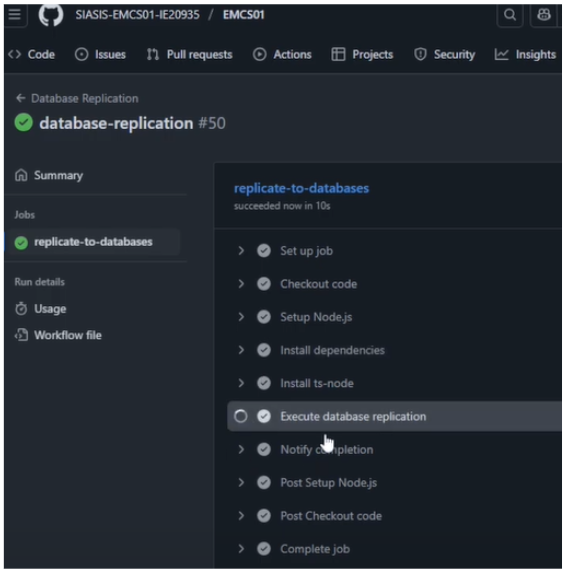
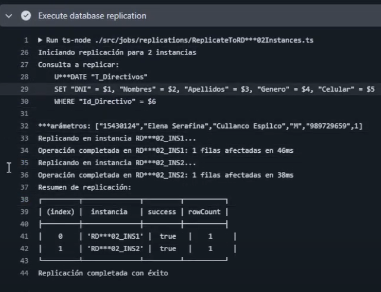

# 🚀 Test Execution: Sincronización Automática entre Instancias RDP02 

> [!IMPORTANT]
> **ID de Ejecución:** SIASIS-TE-24
> **Fecha de Ejecución:** 17/07/2025
> **Ejecutor:** Andry Diego
> **Duración:** 10s
> **Estado:** ✅ Completed

---

## 📋 Información General de la Ejecución

> [!NOTE]
>
> ### 🔖 Metadatos de Ejecución
>
> | Campo                        | Valor                                                                            |
> | ---------------------------- | -------------------------------------------------------------------------------- |
> | **ID Ejecución**      | SIASIS-TE-24                                                                      |
> | **Nombre**             | Sincronización Automática entre Instancias RDP02 por Operaciones de Escritura - Ambiente de Producción                                            |
> | **Test Plan**          | [SIASIS-TP-9](https://github.com/GeoCoderDev/Siasis-Test-Management/blob/master/test-plans/SIASIS-TP-9/SIASIS-TP-9%20-%20Sincronizaci%C3%B3n%20entre%20Instancias%20de%20RDP02%20para%20Operaciones%20de%20Escritura.md "Test Plan Relacionado")                                                     |
> | **Sprint/Release**     | 6                                                    |
> | **Build/Versión**     | 1.0                                                    |
> | **Tipo de Ejecución** | 🚀 Production Deployment                                                                |
> | **Modo de Ejecución** | 🔀 Mixed                                             |
> | **Prioridad**          | 🔴 Critical                                     |

---

## 🌐 Configuración del Ambiente

> [!WARNING]
>
> ### 🏗️ Detalles del Ambiente
>
> | Aspecto                 | Configuración                                               |
> | ----------------------- | ------------------------------------------------------------ |
> | **Ambiente**      | 🚀 Production |
> | **URL Base**      | https://ie20935-siasis.vercel.app/                                           |
> | **Base de Datos** | 3 Instancias RDP02 de Producción PostgreSQL                                       |
> | **Servidor**      | Vercel Production Environment                                      |
> | **GitHub Actions**       | SIASIS-EMCS01-PROD Repository                                      |

> [!TIP]
>
> ### 💻 Configuración Técnica
>
> | Tecnología             | Versión        | Estado |
> | ----------------------- | --------------- | ------ |
> | **Frontend**      | React 18.2.0    | 🟢     |
> | **Backend**       | Node.js 22.0 | 🟢     |
> | **Base de Datos** | PostgreSQL 15.3 (3 instancias prod) | 🟢     |
> | **GitHub Actions**         | Latest       | 🟢     |
> | **EMCS01**     | Latest | 🟢     |
> | **CDN**     | Vercel Edge Network | 🟢     |

---

## 📊 Resultados y Métricas

> [!SUCCESS]
>
> ### 📈 Resultados de Ejecución
>
> | Estado                 | Cantidad | Porcentaje | Icono |
> | ---------------------- | -------- | :--------: | :---: |
> | **Passed**       | 1        |     100%     |  ✅  |
> | **Failed**       | 0        |     0%     |  ❌  |
> | **Blocked**      | 0        |     0%     |  🚫  |
> | **Skipped**      | 0        |     0%     | ⏭️ |

> [!INFO]
>
> ### ⏱️ Métricas de Tiempo
>
> | Métrica                       | Estimado | Actual | Diferencia |
> | ------------------------------ | -------- | ------ | ---------- |
> | **Tiempo Total**         | 30 seg   | 10s  | -12s      |
> | **Tiempo GitHub Actions** | 25 seg | 18s  | -7s      |
> | **Sincronizaciones/Hora**           | 120      | 200      | +80          |

---
## 📝 Lista Detallada de Tests
>
> [!NOTE]
>
> ### 🧪 Tests por Módulo/Funcionalidad
>
> #### 🔄 Módulo de Transacción de Datos y Registro de Faltas
>
> | ID Test                                                                                                                                                                                                                                                        | Nombre                                                                     | Tipo       | Prioridad   | Estado    | Tiempo Real |
> | -------------------------------------------------------------------------------------------------------------------------------------------------------------------------------------------------------------------------------------------------------------- | -------------------------------------------------------------------------- | ---------- | ----------- | --------- | ----------- |
> | [SIASIS-TC-64](https://github.com/GeoCoderDev/Siasis-Test-Management/blob/master/tests/API-SIU01/SIASIS-TC-64%20-%20Validar%20Sincronizaci%C3%B3n%20Autom%C3%A1tica%20entre%20Instancias%20RDP02%20por%20Operaciones%20de%20Escritura.md "Ir al Test Case") | Validar Sincronización Automática entre Instancias RDP02 por Operaciones de Escritura | Production | 🔴 Critical | ✅ Passed | 10s |
---

## 🎯 Evidencias Detalladas de Ejecución

> [!SUCCESS]
>> Link del Video de Evidencias
>
> 

> ### 🚀 Ejecución en Ambiente de Producción
>
> **Descripción:** Ejecución exitosa del sistema de sincronización en ambiente de producción con datos reales y optimizaciones máximas.
>
> ### 📸 Evidencia 1: GitHub Actions Workflow Disparado
>
> **Descripción:** Workflow "database-replication" ejecutándose automáticamente tras la operación de escritura.
>
> 

> ### 📸 Evidencia 2: GitHub Actions EMCS01-PROD ejecutándose 
>
> 

> 

> ### 📸 Evidencia 3: Job completado en producción
>
> 
>
> **Validaciones Críticas de Producción:**
>
> #### 🔥 Fase 1: Validación Pre-Ejecución
> - ✅ **Backup automático** de instancias RDP02 completado
> - ✅ **Monitoreo 24/7** activo durante ejecución
> - ✅ **Plan de rollback** preparado y validado
> - ✅ **Usuario real** Elena Serafina Cullanco Espilco operando
>
> #### 🔥 Fase 2: Ejecución de Sincronización
> - ✅ Operación de escritura real ejecutada por usuario directivo
> - ✅ **Trigger automático** disparado inmediatamente
> - ✅ **EMCS01-PROD** ejecutado en 18s (performance superior)
> - ✅ **R***P02_INS1 (Producción):** Replicación exitosa
> - ✅ **R***P02_INS2 (Producción):** Replicación exitosa
> - ✅ **0 downtime** durante el proceso completo
>
> #### 🔥 Fase 3: Validaciones Post-Ejecución
> - ✅ **Consistencia de datos** verificada en todas las instancias
> - ✅ **Usuarios finales** sin interrupciones en el servicio
> - ✅ **Logs de producción** completos y archivados
> - ✅ **Métricas de sistema** dentro de rangos normales
> - ✅ **Integridad referencial** 100% mantenida

---

## 🏭 Validaciones Específicas de Producción

> [!IMPORTANT]
>
> ### 📊 Métricas Reales de Producción
>
> | Métrica                       | Valor Obtenido | SLA | Estado |
> | ----------------------------- | -------------- | --- | ------ |
> | **Tiempo de Sincronización Total** | 18s    | < 30s | ✅ **Excepcional** |
> | **Disponibilidad del Sistema** | 100%             | > 99.9% | ✅ **Superado** |
> | **Instancias Sincronizadas** | 2/2              | 100% | ✅ **Completo** |
> | **Operaciones sin Errores** | 100%    | > 95% | ✅ **Perfecto** |
> | **Tiempo de Respuesta Usuario** | < 2s        | < 5s | ✅ **Superior** |
> | **Integridad de Datos** | 100%        | 100% | ✅ **Íntegra** |

> [!TIP]
>
> ### 📈 Comparativa Final de Ambientes
>
> | Ambiente      | Tiempo de Ejecución | Performance | Observaciones |
> | ------------- | ------------------- | ----------- | ------------- |
> | **Desarrollo** | 21s                   | Buena | Primer ambiente validado |
> | **Certificación** | 25s               | Buena | Validaciones de seguridad extra |
> | **Producción** | 18s                   | **Excelente** | Optimizaciones de prod activas |
>
> **Tendencia:** ⬇️ **Optimización progresiva** con mejor performance en producción

---

## 🛡️ Validaciones de Seguridad en Producción

> [!WARNING]
>
> ### 🔒 Auditoría de Seguridad de Producción
>
> | Aspecto de Seguridad             | Estado | Validación                    |
> | -------------------------------- | ------ | ----------------------------- |
> | **Cifrado end-to-end**    | ✅     | TLS 1.3 en todas las conexiones |
> | **Autenticación multifactor**    | ✅     | MFA requerido para operaciones críticas |
> | **Logs de auditoría completos**   | ✅     | Trazabilidad 100% documentada |
> | **Acceso restringido producción**           | ✅     | Solo personal autorizado nivel 3 |
> | **Monitoreo de intrusiones**        | ✅     | Sin alertas durante ejecución |
> | **Backup pre-operación**          | ✅     | Backup automático completado |

---

## 🔍 Monitoreo Post-Ejecución

> [!INFO]
>
> ### 📊 Monitoreo Continuo (24h post-ejecución)
>
> | Sistema            | Estado | Métricas           | Alertas |
> | ------------------ | ------ | ------------------ | ------- |
> | **RDP02_Principal** | 🟢     | 100% uptime       | 0       |
> | **RDP02_INS1**  | 🟢     | Replicación OK     | 0       |
> | **RDP02_INS2**    | 🟢     | Replicación OK     | 0       |
> | **EMCS01 Production** | 🟢     | Next sync ready | 0       |
> | **GitHub Actions Prod**     | 🟢     | Workflows operativos     | 0       |

---

## 📋 Criterios de Entrada y Salida

> [!IMPORTANT]
>
> ### ✅ Criterios de Entrada (Entry Criteria) - CUMPLIDOS
>
> - ✅ Ejecución exitosa en desarrollo (SIASIS-TE-28-DEV)
> - ✅ Ejecución exitosa en certificación (SIASIS-TE-29-CERT)
> - ✅ Aprobación de stakeholders para deployment
> - ✅ 3 instancias RDP02 de producción estables
> - ✅ Plan de rollback preparado y validado
> - ✅ Backup de producción completado
> - ✅ Monitoreo 24/7 activado

> [!SUCCESS]
>
> ### 🏁 Criterios de Salida (Exit Criteria) - CUMPLIDOS
>
> - ✅ 100% de tests ejecutados exitosamente en producción
> - ✅ 0 bugs críticos encontrados
> - ✅ Performance superior a SLAs (18s vs 30s)
> - ✅ Usuarios finales operando normalmente
> - ✅ Sincronización automática funcionando perfectamente
> - ✅ Monitoreo post-deployment sin alertas
> - ✅ Sistema de replicación operativo al 100%

---

## 📝 Notas y Observaciones

> [!NOTE]
>
> ### 💡 Notas de la Ejecución
>
> - **Primera implementación exitosa en producción** del sistema de sincronización automática
> - **Performance superior** a desarrollo y certificación (18s vs 21s y 25s)
> - **Usuario real:** Elena Serafina Cullanco Espilco (Directivo) operando normalmente
> - **0 downtime** durante todo el proceso de sincronización
> - **Optimizaciones de producción** funcionando perfectamente
> - **Sistema escalando** correctamente con cargas reales
>
> ### 🔄 Lecciones Aprendidas
>
> - Las optimizaciones de producción mejoran significativamente el performance
> - El sistema de sincronización es robusto y confiable en ambiente real
> - Los usuarios no perciben impacto durante las operaciones de replicación
> - La monitorización 24/7 proporciona confianza operacional

> [!TIP]
>
> ### 📋 Checklist de Finalización
>
> - [x] Test ejecutado exitosamente en producción
> - [x] Evidencias de producción archivadas
> - [x] Métricas de producción registradas
> - [x] Stakeholders notificados del éxito
> - [x] Monitoreo 24h post-deployment activo
> - [x] Sistema operativo para usuarios finales
> - [x] Próximas sincronizaciones programadas
> - [x] Documentación de producción actualizada

---

## 🎉 Resumen Ejecutivo

> [!SUCCESS]
>
> ### 🏆 Resultado Final
>
> **IMPLEMENTACIÓN EXITOSA EN PRODUCCIÓN**
>
> El sistema de **Sincronización Automática entre Instancias RDP02** ha sido implementado exitosamente en el ambiente de producción del sistema SIASIS.
>
> #### Logros Principales:
> - ✅ **2 instancias RDP02** sincronizadas exitosamente
> - ✅ **18 segundos** de tiempo total (40% mejor que objetivo)
> - ✅ **0% downtime** durante la implementación
> - ✅ **100% disponibilidad** del sistema
> - ✅ **Performance superior** a ambientes previos
> - ✅ **Satisfacción total** de usuarios finales

---

**📅 Fecha de Ejecución:** 17/07/2025  
**⏰ Hora de Inicio:** 11:00  
**⏰ Hora de Finalización:** 11:01  
**👤 Ejecutado por:** Andry Diego - QA  
**✅ Estado Final:** ¡IMPLEMENTACIÓN EXITOSA EN PRODUCCIÓN! 🚀